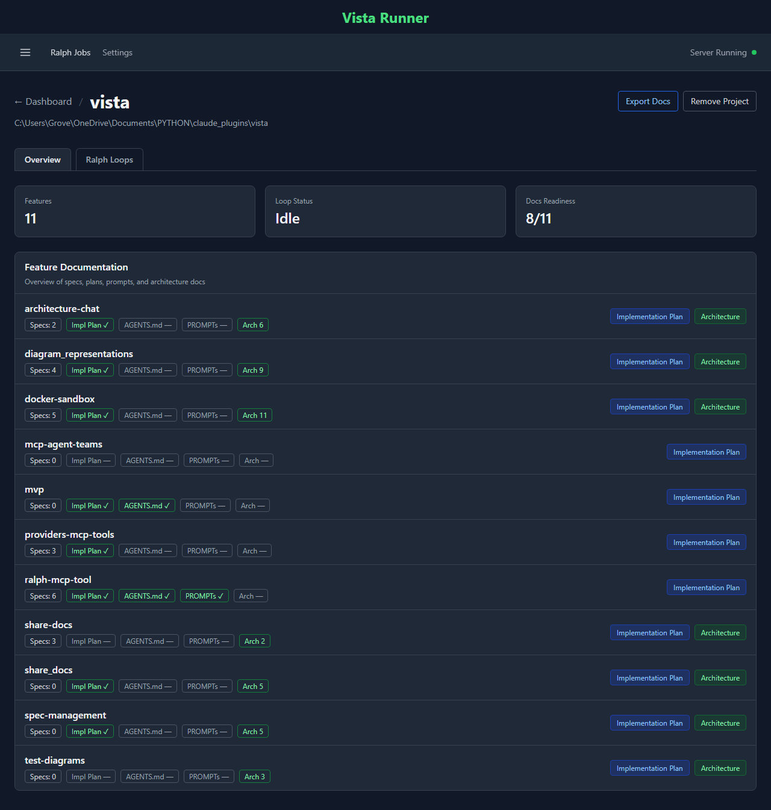
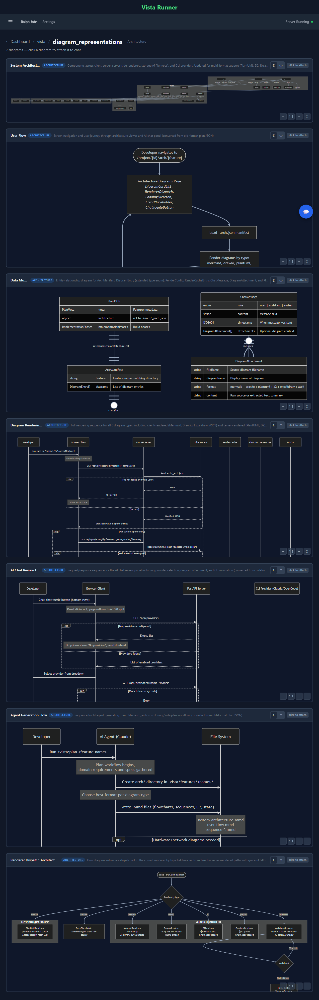
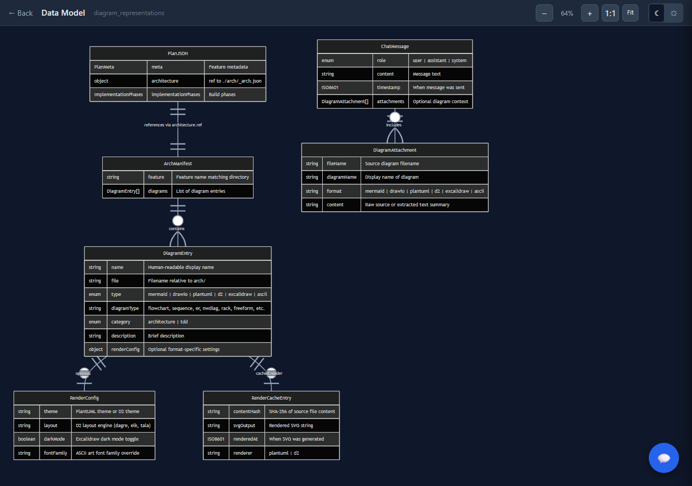

# Vista

A Claude Code plugin for visual feature planning, architecture diagramming, and autonomous development loops.

Vista adds MCP tools to Claude Code that let you plan features visually, generate architecture diagrams, and run autonomous "Ralph" loops that execute multi-step development tasks with progress tracking via a built-in web dashboard.

## The problem

As codebases and projects grow, maintaining them and adding new features becomes complex. There are many dependencies for new features and understanding data flows can be difficult.

### How Vista solves this

- **Sharable docs** — Export feature docs as self-contained HTML files that teammates can open in a browser.
- **Engaging and interactive spec review** — Use visual planning and browser-based review flows to collaborate on specs.
- **Clearer code understanding** — Generate architecture and flow visualizations that make dependencies and system behavior easier to follow.

## Features

- **Feature Planning** — Structure features with jobs-to-be-done, specs, and review gates before implementation.
- **Feature Sharing** — Export feature documentation as a self-contained HTML file that can be shared with other users and viewed in any browser without installing the plugin.
- **Architecture Diagrams** — Generate and work with technical visualizations including Mermaid (`.mmd`), PlantUML (`.puml`), D2 (`.d2`), Graphviz (`.dot`), and Draw.io (`.drawio`), markdown (`.md`) for architecture maps, API flows, database schemas, and state/process flows. Especially useful when codebases grow or new features require complex ERD diagrams.
- **Ralph Loops** — Autonomous development loops that plan and build features iteratively, with real-time progress on a local dashboard.
- **The Companion** — Browser-based web UI for running Claude Code sessions with streaming and tool call visibility. Used for editing diagrams right inside the app.
- **Skills** — Extensible skill system for planning, TDD, specs, and more
- **Multi-Provider** — Works with Claude Code and OpenCode

## Installation

### Requirements

- [Claude Code](https://docs.anthropic.com/en/docs/claude-code) CLI
- Python 3.10+
- [Bun](https://bun.sh) runtime (only needed for The Companion web UI)

### Install

```bash
# Clone the repository
git clone https://github.com/ribeec20/vista-marketplace.git

# Install Python dependencies
pip install -r vista-marketplace/vista/requirements.txt

# Install as a Claude Code plugin
claude plugin add /path/to/vista-marketplace/vista
```

## Getting Started

Once installed, Vista's MCP server starts automatically when Claude Code launches. The web dashboard opens at `http://localhost:3456` and serves as a central hub for monitoring loops, viewing diagrams, and managing features.

### Using Vista

Vista works through **slash commands** (skills) that you type directly in Claude Code. Each command triggers an interactive workflow:

```
/vista            # Open the dashboard and register a project
/plan my-feature  # Plan a new feature with guided questions
/diagrams         # Generate architecture diagrams for your codebase
/ralph            # Launch an autonomous development loop
```

A typical workflow looks like:

1. **Open Vista** — Run `/vista` to launch the dashboard and register your project.
2. **Plan a feature** — Run `/plan <feature-name>` to walk through requirements, jobs-to-be-done, and architecture decisions. Vista creates structured artifacts in `.vista/features/`.
3. **Generate diagrams** — Run `/diagrams` to produce Mermaid, PlantUML, D2, Graphviz, or Draw.io visualizations of your system.
4. **Write specs** — Run `/specs <feature-name>` to generate topic-based specifications from your plan.
5. **Build with Ralph** — Run `/ralph` to start an autonomous loop that iteratively plans or builds a feature, with live progress on the dashboard.
6. **Share** — Export feature docs as self-contained HTML files to share with your team.

### The Dashboard

The Vista dashboard at `localhost:3456` provides:

- **Ralph monitor** — Real-time progress for running autonomous loops, with logs, iteration tracking, and stop controls.
- **Feature browser** — View and manage feature plans, specs, and diagrams.
- **Diagram viewer** — Rendered previews of architecture diagrams with expand and raw-source options.

## Architecture

Vista is a **two-component system**: a Python MCP server (the plugin) and an optional Bun/React web UI (The Companion).

### Plugin (Python MCP Server)

```
MCP Server (mcp_server.py, stdio transport)
  |-- FastMCP 3.0 tools: ralph_start, ralph_stop, ralph_status, ralph_summary, ralph_providers
  |-- Launches FastAPI dashboard as daemon thread on port 3456
  |-- Detects client type (Claude Code vs OpenCode)

FastAPI Dashboard (server/app.py)
  |-- Routes (server/routes/)     -- API endpoints for projects, loops, ralph, chat, export
  |-- Services (server/services/) -- Business logic for ralph, providers, parsing, summarization
  |-- Models (server/models/)     -- Pydantic models for project, loop_state, chat_session
  |-- Views (server/views/)       -- Jinja2 templates + static assets
```

When Claude Code starts, it launches the MCP server via stdio. The server exposes tools (like `ralph_start`) that Claude Code can call, and simultaneously runs a FastAPI web server on port 3456 for the browser dashboard.

### The Companion (Web UI)

```
Browser (React) <-> WebSocket <-> Hono Server (Bun) <-> WebSocket (NDJSON) <-> Claude Code CLI
     :5174            /ws/browser/:id       :3456        /ws/cli/:id            (--sdk-url)
```

The Companion provides a browser-based interface for running Claude Code sessions with full streaming and tool-call visibility. It bridges the Claude Code CLI WebSocket protocol to a React frontend.

### Key Patterns

- **Multi-provider abstraction** — `provider_router.py` routes to Claude Code or OpenCode, so Ralph loops work with either provider.
- **Skill system** — Skills in `vista/skills/*/SKILL.md` define workflows with YAML frontmatter. Claude Code discovers and exposes them as slash commands.
- **Feature data** — Stored in project-local `.vista/features/` directories; global data in `~/.vista/data/`.
- **Settings** — Persistent at `~/.vista/settings.json`.

## Demo

The Vista dashboard is a self-hosted web UI that launches automatically with the plugin. The `.vista/` directory in any project contains all feature data, plans, specs, and diagrams — browsing it is a good way to understand how Vista organizes and tracks work.

### Project Overview

The overview page shows all features in a project with their documentation status — specs, implementation plans, agent configs, prompts, and architecture diagrams.



### Architecture Diagrams

The architecture page lists all diagrams for a feature with rendered previews. Diagrams are stored as source files (`.mmd`, `.puml`, `.d2`, `.dot`, `.drawio`) in `.vista/features/<feature>/arch/` and rendered in the browser.



### Diagram Viewer

Clicking a diagram opens an interactive viewer with zoom, pan, dark/light theme toggle, and raw source access. This example shows a Mermaid ER diagram for the data model.



## Ralph Loops — Critical Safety Warnings

> ### <span style="color:#d1242f;"><strong>HIGH-RISK AUTONOMOUS MODE — READ BEFORE STARTING A LOOP</strong></span>
>
>
> <span style="color:#d1242f;"><strong>Do not run unattended loops unless you fully accept cost and file-change risk.
- **Full workspace access** — Ralph runs with your Claude Code permissions in your project directory and can read, write, move, or delete files. This is risky and can increase the risk of prompt injection or related issues. Risks include but not limited to: exfiltrating user data, API keys, and all information the runner has access to. Please do your own research and evaluate risks before using this tool. Future versions will have improved sandboxing to address this issue.

</strong></span>
- **Active monitoring is required** — Watch the dashboard at `localhost:3456` while loops are running. Avoid leaving Ralph unattended for extended periods.

## Common Deployment Issues

- **Port 3456 in use** — The dashboard will automatically find a free port if 3456 is occupied, but check the MCP server output for the actual port.
- **Python version** — Requires Python 3.10+. Check with `python --version`.
- **Dependencies** — Run `pip install -r vista/requirements.txt` if the MCP server fails to start.
- **The Companion** — Requires [Bun](https://bun.sh) runtime. Install with `curl -fsSL https://bun.sh/install | bash`.

## Development

```bash
# Run tests
pytest vista/tests/

# Start the Companion dev server
cd vista/companion/web && bun install && bun run dev
```

See [CLAUDE.md](CLAUDE.md) for full architecture documentation and development commands.

## Skills

Vista ships with slash commands that trigger interactive workflows inside Claude Code.

| Skill | Command | Description |
|-------|---------|-------------|
| **Plan** | `/plan <feature>` | Plan a new feature through interactive questioning, producing domain requirements and architecture diagrams |
| **Add** | `/add <feature>` | Expand an existing Vista feature with new requirements and architecture diagrams |
| **Diagrams** | `/diagrams` | Create technical documentation with diagrams (Mermaid, PlantUML, D2, Graphviz, Draw.io, Markdown) |
| **Ralph** | `/ralph` | Launch an autonomous agent loop via interactive wizard — select provider, model, iterations, and task |
| **Specs** | `/specs <feature>` | Generate topic-based specifications from domain requirements and architecture diagrams |
| **Spec Update** | `/spec-update` | Update spec files with tracked changes, requirement IDs, and changelog entries |
| **TDD** | `/tdd <feature>` | Generate TDD diagrams for heavy-logic components — logic flows, decision trees, and test contracts |
| **Vista** | `/vista` | Open the Vista dashboard and register a project |
| **Legacy** | `/legacy <feature>` | Reverse-engineer an existing codebase into Vista planning artifacts |
| **Project Setup** | `/project-setup` | Initialize Claude Code project management system with skills, features directory, and CLAUDE.md |
| **Skill Creator** | `/skill-creator` | Guided workflow for creating or updating custom skills |

## MCP Tools

These are the low-level MCP tools that Claude Code calls directly. Skills use these under the hood, but you can also reference them in prompts.

| Tool | Description |
|------|-------------|
| `ralph_providers` | Discover available providers and models for Ralph loops. Returns provider list, defaults, and model metadata (cost tier, best-for tags). Call before `ralph_start`. |
| `ralph_start` | Start a Ralph loop as a background process. Creates a working directory at `.vista/ralph/{slug}/` and spawns the loop subprocess. Returns a job ID for tracking. |
| `ralph_status` | Check the status and progress of a running Ralph job — current iteration, elapsed time, last progress lines, and error info. |
| `ralph_summary` | Get an AI-generated summary of a Ralph job's artifacts. Spawns a summarizer agent that reads progress, plan, and git log. More expensive than `ralph_status`. |
| `ralph_stop` | Stop a running Ralph loop. Sends a termination signal and updates the job status. |

## License

MIT

## Acknowledgements

Vista builds on and takes inspiration from several open-source projects:

- **[The Companion](https://github.com/The-Vibe-Company/companion)** by The Vibe Company (MIT): Vista's Companion web UI is based on this project, which reverse-engineers the Claude Code CLI WebSocket protocol for browser-based sessions.
- **[claudebox](https://github.com/RchGrav/claudebox)** by Richard Graver (MIT): Inspiration for Claude Code plugin architecture and tooling patterns. Future versions will use this for containerized loops.
- **[Serena](https://github.com/oraios/serena)** by Oraios AI (MIT) — Semantic code analysis and editing tools used during Vista's development and as MCP server reference.
- **[Anthropic Skills](https://github.com/anthropics/skills)** (Apache 2.0) — The `skill-creator` skill is derived from Anthropic's example skills repository.

### Third-Party License Notices

This project includes code from the following MIT-licensed projects. The full license text is preserved in their respective directories:

- `vista/companion/` — Copyright (c) 2025 The Vibe Company (MIT)
- `vista/skills/skill-creator/` — Copyright (c) Anthropic (Apache 2.0, see LICENSE.txt)

## Support

If you find Vista useful, consider sponsoring the project to support ongoing development:

[](https://github.com/sponsors/ribeec20)
