# Graphviz (DOT) Format Reference

> Complete reference for creating Graphviz diagrams in Vista.
> Use Graphviz when you need automatic graph layout for dependency graphs, network topology, tree structures, or any graph-structured data.

## Table of Contents

- [File Format](#file-format)
- [When to Choose Graphviz](#when-to-choose-graphviz)
- [Graph Types](#graph-types)
- [Node Attributes](#node-attributes)
- [Edge Attributes](#edge-attributes)
- [Graph Attributes](#graph-attributes)
- [Layout Engines](#layout-engines)
- [Subgraph Clusters](#subgraph-clusters)
- [Rank Constraints](#rank-constraints)
- [HTML-Like Labels](#html-like-labels)
- [Record Shapes](#record-shapes)
- [Styling Patterns](#styling-patterns)
- [Vista Integration](#vista-integration)
- [Complete Examples](#complete-examples)

---

## File Format

- **Extension:** `.dot`
- **Encoding:** UTF-8
- **Comments:** C-style `//` single line or `/* ... */` block
- **Statement terminator:** Semicolons are optional but recommended

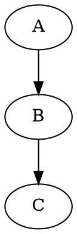

---

## When to Choose Graphviz

| Use Case | Why Graphviz | Alternative |
|----------|-------------|-------------|
| Dependency graphs | Automatic hierarchical layout | Mermaid flowchart (manual layout) |
| Network topology | `neato`/`fdp` spring layout | None — Mermaid has no spring layout |
| Large node counts (50+) | Handles hundreds of nodes | Mermaid struggles >30 nodes |
| Tree structures | `dot` engine optimized for trees | Mermaid mindmap (limited) |
| Circular layouts | `circo` engine | None in Mermaid |
| Radial layouts | `twopi` engine | None in Mermaid |
| Custom shapes (record/HTML) | Rich label formatting | Mermaid (limited shapes) |

**Rule of thumb:** Use Graphviz when graph structure matters more than semantic diagram types (sequence, state, ER).

---

## Graph Types

### Directed Graph (`digraph`)

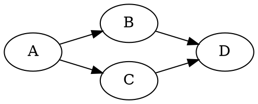

### Undirected Graph (`graph`)

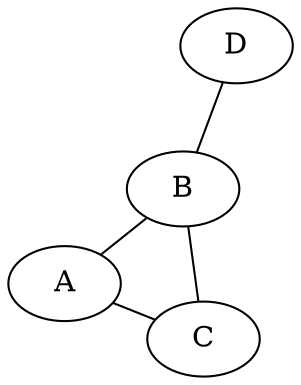

### Strict Graphs (no duplicate edges)


---

## Node Attributes

### Common Attributes

| Attribute | Values | Default | Description |
|-----------|--------|---------|-------------|
| `shape` | See shapes below | `ellipse` | Node shape |
| `label` | string | node name | Display text |
| `color` | color | `black` | Border color |
| `fillcolor` | color | `lightgrey` | Fill color (requires `style=filled`) |
| `style` | `filled`, `dashed`, `dotted`, `bold`, `rounded`, `invis` | — | Visual style |
| `fontname` | font name | `Times-Roman` | Font family |
| `fontsize` | number | `14` | Font size in points |
| `fontcolor` | color | `black` | Text color |
| `width` | inches | — | Minimum width |
| `height` | inches | — | Minimum height |
| `penwidth` | number | `1.0` | Border thickness |
| `tooltip` | string | — | Hover text (SVG output) |
| `URL` | URL | — | Clickable link (SVG output) |

### Node Shapes

**Basic shapes:**
```dot
digraph Shapes {
    a [shape=box, label="box"];
    b [shape=ellipse, label="ellipse"];
    c [shape=circle, label="circle"];
    d [shape=diamond, label="diamond"];
    e [shape=triangle, label="triangle"];
    f [shape=pentagon, label="pentagon"];
    g [shape=hexagon, label="hexagon"];
    h [shape=octagon, label="octagon"];
    i [shape=doublecircle, label="doublecircle"];
    j [shape=doubleoctagon, label="doubleoctagon"];
    k [shape=cylinder, label="cylinder"];
    l [shape=note, label="note"];
    m [shape=folder, label="folder"];
    n [shape=component, label="component"];
    o [shape=tab, label="tab"];
    p [shape=box3d, label="box3d"];
    q [shape=house, label="house"];
    r [shape=parallelogram, label="parallelogram"];
    s [shape=plain, label="plain (no border)"];
    t [shape=point]; // tiny dot
}
```

**Special shapes:**
- `record` / `Mrecord` — Structured fields (see [Record Shapes](#record-shapes))
- `plaintext` — Label only, no border
- `point` — Tiny dot (used for routing edges)

### Setting Default Node Attributes

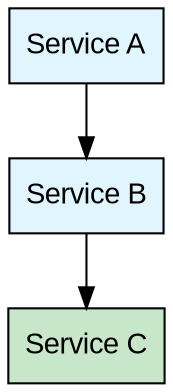

---

## Edge Attributes

| Attribute | Values | Default | Description |
|-----------|--------|---------|-------------|
| `label` | string | — | Edge label |
| `color` | color | `black` | Edge color |
| `style` | `solid`, `dashed`, `dotted`, `bold`, `invis` | `solid` | Line style |
| `dir` | `forward`, `back`, `both`, `none` | `forward` | Arrow direction |
| `arrowhead` | See arrows below | `normal` | Head arrow shape |
| `arrowtail` | See arrows below | — | Tail arrow shape |
| `penwidth` | number | `1.0` | Line thickness |
| `weight` | number | `1` | Layout priority (higher = shorter/straighter) |
| `constraint` | `true`/`false` | `true` | Affects rank layout |
| `headlabel` | string | — | Label near arrowhead |
| `taillabel` | string | — | Label near tail |
| `fontname` | font name | — | Label font |
| `fontsize` | number | `14` | Label font size |
| `fontcolor` | color | `black` | Label color |

### Arrow Shapes

| Shape | Description |
|-------|-------------|
| `normal` | Standard filled arrow |
| `dot` | Filled circle |
| `odot` | Open circle |
| `diamond` | Filled diamond |
| `odiamond` | Open diamond |
| `box` | Filled square |
| `obox` | Open square |
| `vee` | Open V arrow |
| `inv` | Inverted arrow |
| `none` | No arrowhead |
| `crow` | Crow's foot |
| `tee` | Flat bar |

**Combine modifiers:** `arrowhead=odiamond` (hollow diamond for UML aggregation)

### Setting Default Edge Attributes

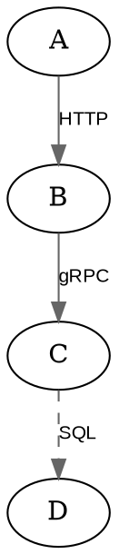

---

## Graph Attributes

| Attribute | Values | Default | Description |
|-----------|--------|---------|-------------|
| `rankdir` | `TB`, `BT`, `LR`, `RL` | `TB` | Graph direction |
| `splines` | `true`, `ortho`, `polyline`, `curved`, `line`, `false` | `true` | Edge routing |
| `bgcolor` | color | `white` | Background color |
| `fontname` | font name | — | Default font |
| `fontsize` | number | — | Default font size |
| `label` | string | — | Graph title |
| `labelloc` | `t`, `b` | `b` | Title position |
| `nodesep` | inches | `0.25` | Horizontal spacing |
| `ranksep` | inches | `0.5` | Vertical spacing (rank gap) |
| `ratio` | `fill`, `compress`, `auto`, number | — | Aspect ratio |
| `size` | `"w,h"` | — | Maximum size in inches |
| `compound` | `true`/`false` | `false` | Allow edges between clusters |
| `concentrate` | `true`/`false` | `false` | Merge parallel edges |
| `overlap` | `true`, `false`, `scale`, `prism` | — | Node overlap handling |
| `pad` | inches | `0.0555` | Margin around graph |

### Rankdir Examples

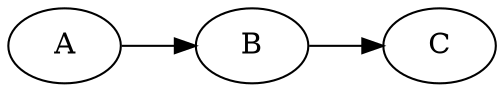

### Spline Types

```dot
digraph G {
    splines=ortho;  // Right-angle edges (clean for architecture)
    // splines=polyline;  // Straight segments
    // splines=curved;    // Smooth curves
    // splines=line;      // Straight lines only
}
```

---

## Layout Engines

Graphviz provides multiple layout algorithms. Choose based on your graph structure.

| Engine | Best For | Algorithm | When to Use |
|--------|----------|-----------|-------------|
| `dot` | Hierarchies, trees, DAGs | Layered/Sugiyama | **Default** — directed acyclic graphs, org charts, dependency trees |
| `neato` | Undirected graphs | Spring model (Kamada-Kawai) | Network topology, peer relationships, small graphs |
| `fdp` | Large undirected graphs | Force-directed (Fruchterman-Reingold) | Large networks (100+ nodes), cluster visualization |
| `circo` | Circular layouts | Circular | Ring topology, protocol state machines, cyclic relationships |
| `twopi` | Radial hierarchies | Radial | Broadcast trees, influence maps, hub-spoke architectures |
| `sfdp` | Very large graphs | Scalable force-directed | Graphs with 1000+ nodes |
| `osage` | Array/grid layouts | Tree map | Regular grid arrangements |
| `patchwork` | Treemaps | Squarified treemap | Disk usage, proportional visualization |

### Setting the Engine

```dot
digraph G {
    layout=neato;  // or fdp, circo, twopi, sfdp

    A -- B;
    B -- C;
    C -- A;
}
```

**Note:** In Vista, the layout engine defaults to `dot`. Specify `layout=` explicitly for other engines.

---

## Subgraph Clusters

Clusters group nodes visually with a bounding box. The subgraph name **must** start with `cluster`.

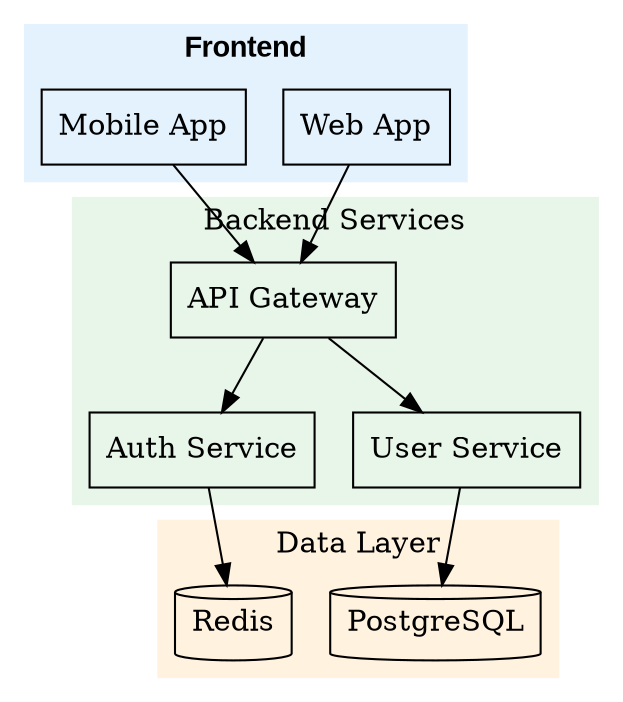

### Nested Clusters

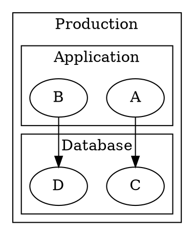

### Edges Between Clusters

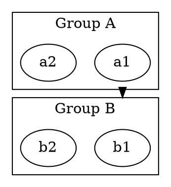

---

## Rank Constraints

Control vertical positioning of nodes within the `dot` layout.

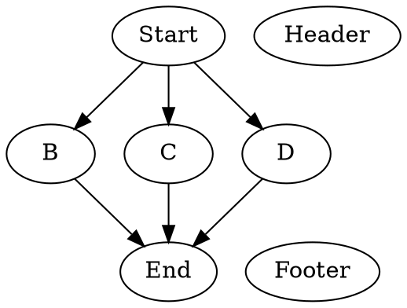

---

## HTML-Like Labels

For rich formatting inside nodes, use HTML-like labels enclosed in `< >`.

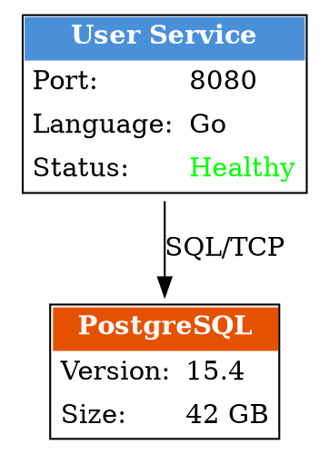

### HTML Label Tags

| Tag | Purpose |
|-----|---------|
| `<TABLE>` | Table container |
| `<TR>` | Table row |
| `<TD>` | Table cell |
| `<B>` | Bold |
| `<I>` | Italic |
| `<U>` | Underline |
| `<FONT>` | Font styling (`COLOR`, `FACE`, `POINT-SIZE`) |
| `<BR/>` | Line break |
| `` | Image (SVG only) |

### TD Attributes

| Attribute | Values |
|-----------|--------|
| `BGCOLOR` | Color |
| `COLSPAN` | Number |
| `ROWSPAN` | Number |
| `ALIGN` | `LEFT`, `CENTER`, `RIGHT` |
| `VALIGN` | `TOP`, `MIDDLE`, `BOTTOM` |
| `PORT` | Port name (for edge targeting) |
| `BORDER` | Border width |

---

## Record Shapes

Record shapes create structured nodes with named fields (ports).

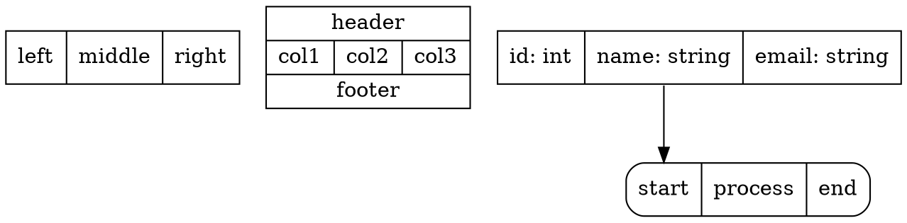

### Class-like Records

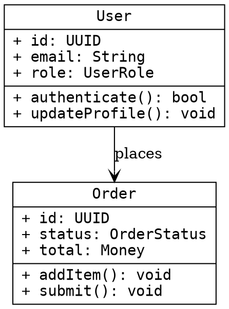

> **Note:** `\l` = left-align, `\r` = right-align, `\n` = center. These control text alignment inside record fields.

---

## Styling Patterns

### Color Specifications

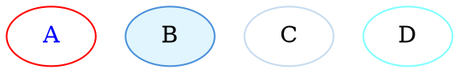

### Consistent Architecture Style

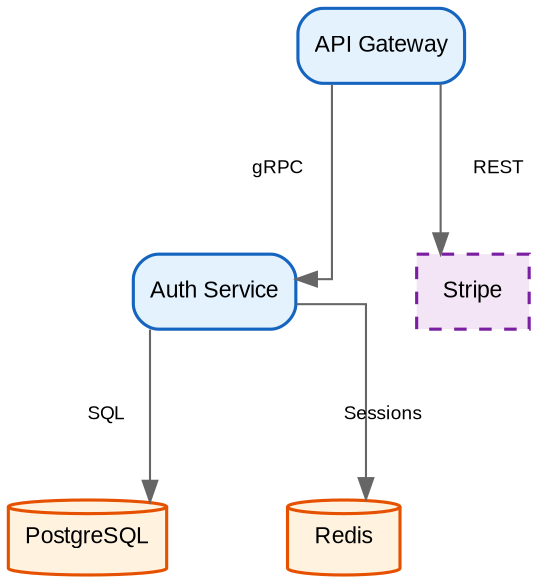

---

## Vista Integration

### Rendering

Graphviz diagrams are rendered client-side using `@viz-js/viz`, a WebAssembly port of Graphviz (~2.5MB, lazy-loaded on first use).

The rendering pipeline:
1. Vista reads the `.dot` file content
2. Loads viz.js WASM module (cached after first load)
3. Renders to SVG in the browser
4. Displays in the architecture viewer

### Manifest Configuration

In `_arch.json`:

```json
{
    "diagrams": [
        {
            "id": "dependency-graph",
            "title": "Module Dependencies",
            "file": "dependencies.dot",
            "type": "graphviz",
            "diagramType": "custom"
        }
    ]
}
```

- **`type`**: Must be `"graphviz"`
- **`diagramType`**: Use `"custom"` for all Graphviz diagrams

### File Organization

```
docs/<feature>/arch/
├── _arch.json
├── overview.mmd           (Mermaid for simple diagrams)
├── dependencies.dot       (Graphviz for dependency graph)
├── network-topology.dot   (Graphviz for network layout)
└── README.md
```

### Best Practices

1. **Set `rankdir`** explicitly — Don't rely on the default `TB`
2. **Use `splines=ortho`** for architecture diagrams — Clean right-angle edges
3. **Use `splines=true`** for dependency graphs — Curved edges reduce visual clutter
4. **Always set `fontname`** — Default Times-Roman looks dated; use `"Arial"` or `"Helvetica"`
5. **Use clusters for grouping** — Name must start with `cluster_`
6. **Keep node count reasonable** — viz.js handles hundreds but rendering slows past ~200 nodes
7. **Use `concentrate=true`** for dense graphs — Merges parallel edges
8. **Specify `layout=`** when not using `dot` — Engine choice matters for readability

---

## Complete Examples

### Dependency Graph

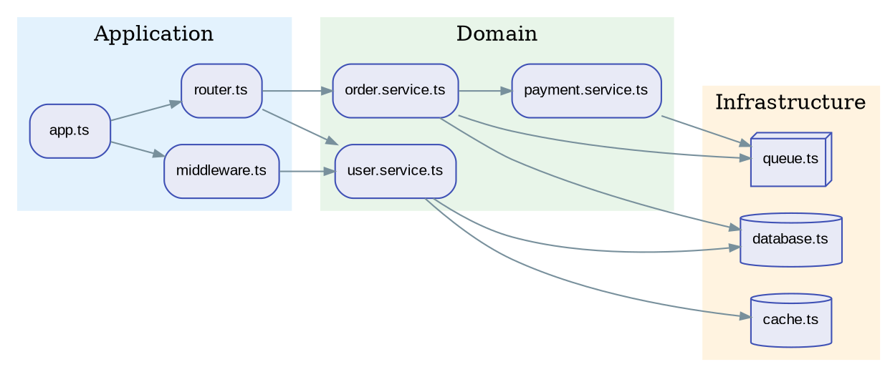

### Network Topology

```dot
graph NetworkTopology {
    layout=neato;
    overlap=false;
    splines=true;

    node [shape=box, style=filled, fontname="Arial", fontsize=10];
    edge [color="#78909C", len=2.0];

    // Core
    node [fillcolor="#FFCDD2", color="#C62828"];
    core1 [label="Core\nSwitch 1"];
    core2 [label="Core\nSwitch 2"];

    // Distribution
    node [fillcolor="#FFF9C4", color="#F57F17"];
    dist1 [label="Dist 1"];
    dist2 [label="Dist 2"];
    dist3 [label="Dist 3"];

    // Access
    node [fillcolor="#C8E6C9", color="#2E7D32"];
    acc1 [label="Floor 1"];
    acc2 [label="Floor 2"];
    acc3 [label="Floor 3"];
    acc4 [label="Floor 4"];
    acc5 [label="Floor 5"];
    acc6 [label="Floor 6"];

    // Redundant core link
    core1 -- core2 [style=bold, color="#C62828", penwidth=3];

    // Distribution links
    core1 -- dist1;
    core1 -- dist2;
    core2 -- dist2;
    core2 -- dist3;
    core1 -- dist3;
    core2 -- dist1;

    // Access links
    dist1 -- acc1;
    dist1 -- acc2;
    dist2 -- acc3;
    dist2 -- acc4;
    dist3 -- acc5;
    dist3 -- acc6;
}
```

### Tree with Record Shapes

```dot
digraph AST {
    rankdir=TB;
    node [shape=record, fontname="Courier", fontsize=10, style=filled, fillcolor="#FAFAFA"];
    edge [arrowsize=0.7];

    program [label="<f0> Program|<f1> body: [2 statements]", fillcolor="#E3F2FD"];

    vardecl [label="<f0> VariableDeclaration|<f1> kind: const|<f2> id: greeting|<f3> init: StringLiteral"];
    strlit [label="<f0> StringLiteral|<f1> value: \"hello\"", fillcolor="#E8F5E9"];

    exprstmt [label="<f0> ExpressionStatement|<f1> expression: CallExpression"];
    call [label="<f0> CallExpression|<f1> callee: console.log|<f2> args: [1]"];
    ident [label="<f0> Identifier|<f1> name: greeting", fillcolor="#FFF3E0"];

    program:f1 -> vardecl:f0;
    program:f1 -> exprstmt:f0;
    vardecl:f3 -> strlit:f0;
    exprstmt:f1 -> call:f0;
    call:f2 -> ident:f0;
}
```

---

*This reference is part of the docs-with-mermaid Vista skill. For Mermaid diagrams, see [mermaid-reference.md](mermaid-reference.md). For PlantUML, see [plantuml-format.md](plantuml-format.md).*
