# Mermaid Advanced Diagrams — Strict Reference

> Load this file when creating C4, sequence, state, class, ER, or Gantt diagrams in Mermaid.
> For basic Mermaid syntax (flowcharts, mindmaps, pie, timeline, git graph, etc.), see [mermaid-reference.md](mermaid-reference.md).

## Table of Contents

- [C4 Architecture Diagrams](#c4-architecture-diagrams)
- [Sequence Diagrams](#sequence-diagrams)
- [State Diagrams](#state-diagrams)
- [Class Diagrams](#class-diagrams)
- [ER Diagrams](#er-diagrams)
- [Gantt Charts](#gantt-charts)

---

## C4 Architecture Diagrams

### When to Use C4

Use C4 diagrams when documenting software architecture at different abstraction levels. The C4 model defines four levels:

1. **Context** — Shows the system in its environment (users, external systems)
2. **Container** — Shows the high-level tech choices (apps, databases, message brokers)
3. **Component** — Shows the internals of a single container
4. **Deployment** — Shows infrastructure mapping (Mermaid lacks this — use PlantUML)

### The Four Levels

| Level | Mermaid Keyword | Shows | Audience |
|-------|----------------|-------|----------|
| Context | `C4Context` | System + external actors | Everyone |
| Container | `C4Container` | Applications, databases, queues | Technical staff |
| Component | `C4Component` | Internal modules/services | Developers |
| Deployment | N/A | Infrastructure nodes | DevOps |

### Strict Syntax Rules

1. **Diagram declaration** — Must be one of: `C4Context`, `C4Container`, `C4Component`
2. **Element functions** — Use function-call syntax with parentheses:
   - `Person(alias, "Label", "Description")`
   - `System(alias, "Label", "Description")`
   - `System_Ext(alias, "Label", "Description")`
   - `Container(alias, "Label", "Technology", "Description")`
   - `ContainerDb(alias, "Label", "Technology", "Description")`
   - `ContainerQueue(alias, "Label", "Technology", "Description")`
   - `Component(alias, "Label", "Technology", "Description")`
3. **Boundaries** — Use `_Boundary` variants with curly braces:
   - `System_Boundary(alias, "Label") { ... }`
   - `Container_Boundary(alias, "Label") { ... }`
   - `Enterprise_Boundary(alias, "Label") { ... }`
4. **Relationships** — `Rel(from, to, "Label", "Technology")` — always 4 arguments
5. **IDs** — Must be unique alphanumeric strings (no spaces, no special characters)
6. **Title** — `title System Context Diagram - My System` (optional but recommended)

### Required Elements Checklist

**Context Diagram:**
- [ ] At least one `Person()` (the primary user)
- [ ] The `System()` being documented (exactly one)
- [ ] All `System_Ext()` dependencies
- [ ] `Rel()` for every interaction

**Container Diagram:**
- [ ] `System_Boundary()` wrapping all containers
- [ ] `Container()` for each application
- [ ] `ContainerDb()` for databases
- [ ] `ContainerQueue()` for message brokers
- [ ] External systems outside the boundary

**Component Diagram:**
- [ ] `Container_Boundary()` wrapping all components
- [ ] `Component()` for each internal module
- [ ] Sibling containers shown outside the boundary

### Common Pitfalls and Anti-Patterns

| Pitfall | Wrong | Right |
|---------|-------|-------|
| Using flowchart subgraphs | `subgraph "My System"` | `System_Boundary(sys, "My System")` |
| Missing `_Ext` for external | `System(stripe, "Stripe")` | `System_Ext(stripe, "Stripe", "Payment")` |
| Mixing abstraction levels | Container inside C4Context | One level per diagram |
| Forgetting technology arg | `Container(api, "API")` | `Container(api, "API", "Node.js", "Desc")` |
| Using `Container` for a DB | `Container(db, "DB", "PG")` | `ContainerDb(db, "DB", "PostgreSQL", "Stores data")` |
| IDs with spaces | `Person(my user, ...)` | `Person(myUser, ...)` |
| Missing Rel technology | `Rel(a, b, "Calls")` | `Rel(a, b, "Calls", "HTTPS/JSON")` |

### Complete Examples

#### Context Level

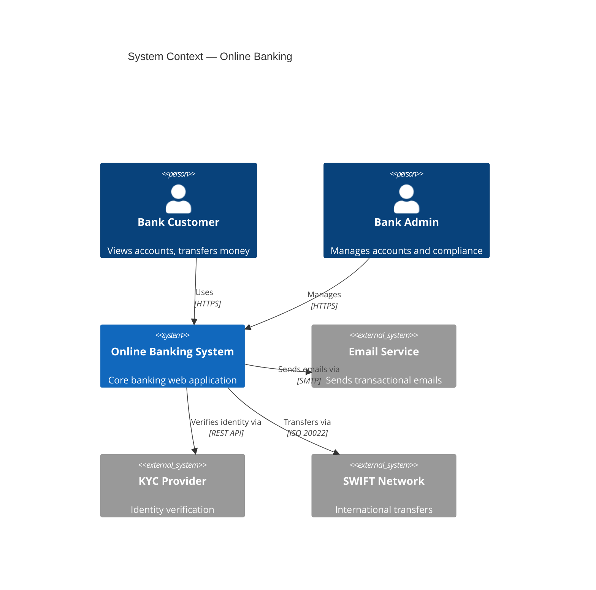

#### Container Level

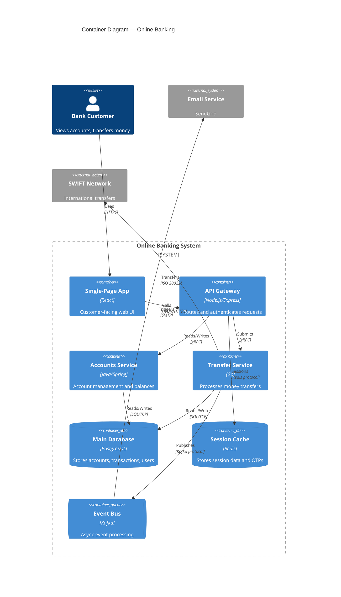

#### Component Level

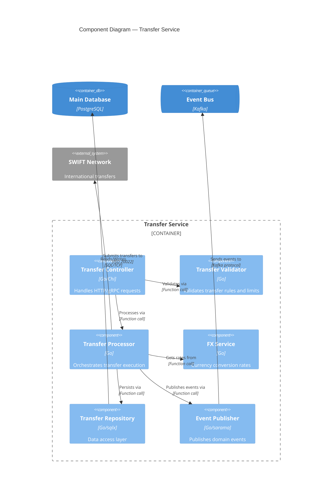

> **Note:** Mermaid does not support C4 Deployment diagrams (`Deployment_Node` is not available). For deployment-level diagrams, use PlantUML — see [plantuml-format.md](plantuml-format.md).

---

## Sequence Diagrams

### When to Use Sequences

- API request/response flows
- Authentication/authorization protocols
- Service-to-service communication
- Event-driven message flows
- Any interaction pattern over time

### Strict Syntax Rules

1. **Declare participants before messages** — Always declare all participants at the top:
   ```
   participant A as "Service A"
   actor U as "User"
   ```
2. **Participant vs Actor** — `actor` renders a stick figure, `participant` renders a box
3. **Arrow types** (memorize these):
   | Arrow | Meaning | When to Use |
   |-------|---------|-------------|
   | `->>` | Solid + filled arrowhead | Synchronous request |
   | `-->>` | Dotted + filled arrowhead | Return/response |
   | `-)` | Solid + open arrowhead | Fire-and-forget (async) |
   | `--)` | Dotted + open arrowhead | Async response |
   | `-x` | Solid + cross | Lost/failed message |
   | `--x` | Dotted + cross | Failed response |

4. **Activation shorthand** — Use `+`/`-` on arrows instead of separate activate/deactivate:
   ```
   A->>+B: Request    %% activates B
   B-->>-A: Response   %% deactivates B
   ```
5. **All control flow blocks must end with `end`**:
   ```
   alt / else / end
   opt / end
   loop / end
   par / and / end
   critical / option / end
   break / end
   ```
6. **Notes** — Three placement options:
   ```
   Note right of A: Text
   Note left of A: Text
   Note over A,B: Text spanning participants
   ```

### Advanced Patterns

#### alt/opt/par/critical/break

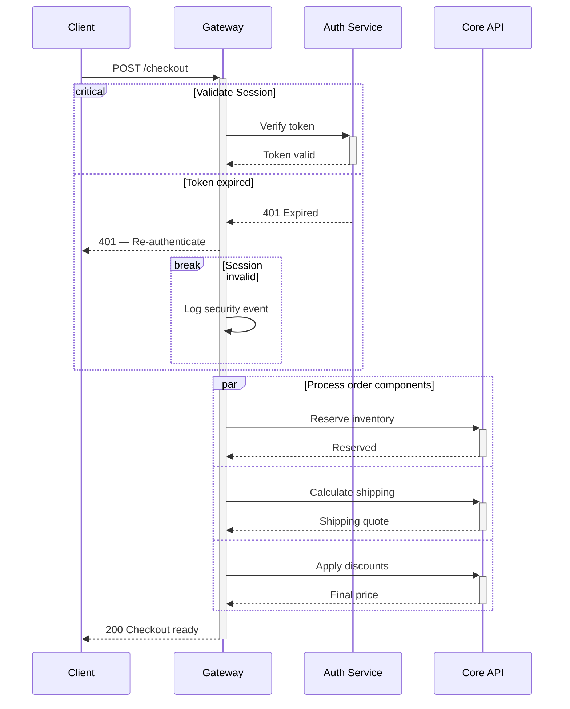

#### rect Highlighting and autonumber

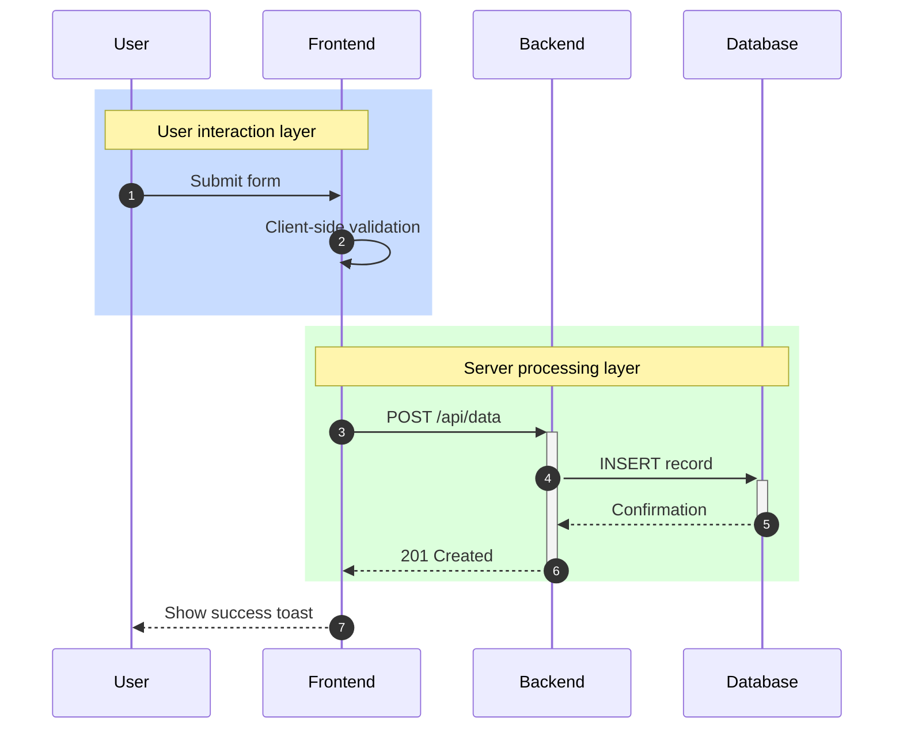

### Common Pitfalls and Anti-Patterns

| Pitfall | Problem | Fix |
|---------|---------|-----|
| Missing `end` keyword | Diagram won't render | Every `alt`, `opt`, `loop`, `par`, `critical`, `break` needs `end` |
| >7 participants | Diagram becomes unreadable | Split into multiple diagrams or merge participants |
| Open activation bars | Bar extends to diagram bottom | Match every `+` with a `-` on the return arrow |
| Undeclared participants | Implicit ordering, aliasing fails | Always declare `participant`/`actor` at top |
| Wrong arrow for return | Using `->>` for responses | Use `-->>` (dotted) for all return/response messages |
| Notes on undeclared | `Note right of X` where X not declared | Declare participant first |
| Nested alt without clarity | Deep nesting becomes confusing | Use `rect` highlighting or split diagrams |

---

## State Diagrams

### When to Use State Diagrams

- Object lifecycle (order, ticket, user account)
- UI state machines
- Protocol states (connection, authentication)
- Workflow engines
- Approval processes

### Strict Syntax Rules

1. **Always use v2** — Start with `stateDiagram-v2` (not `stateDiagram`)
2. **Initial/terminal states** — `[*]` represents both:
   - `[*] --> FirstState` (initial)
   - `LastState --> [*]` (terminal)
3. **Transitions** — `StateA --> StateB : event [guard] / action`
4. **Composite states** — Use `state Parent { }` with nested `[*]`:
   ```
   state Parent {
       [*] --> Child1
       Child1 --> Child2
   }
   ```
5. **Parallel regions** — Separate with `--` inside composite:
   ```
   state Parallel {
       [*] --> A
       --
       [*] --> B
   }
   ```
6. **Choice pseudo-state** — `state name <<choice>>`
7. **Fork/Join** — `state name <<fork>>` and `state name <<join>>`
8. **Notes** — `note right of State : Text` or `note left of State : Text`
9. **State descriptions** — `StateName : This is a description`

### Common Pitfalls and Anti-Patterns

| Pitfall | Problem | Fix |
|---------|---------|-----|
| Using v1 syntax | `stateDiagram` lacks features | Always use `stateDiagram-v2` |
| Orphaned states | States with no transitions in/out | Every state needs at least one transition |
| Composite without inner `[*]` | No clear starting state inside | Add `[*] --> FirstChild` inside composite |
| Fork without join | Parallel paths never converge | Every `<<fork>>` should have a matching `<<join>>` |
| Too many top-level states | Flat diagram > 8 states is unreadable | Group into composite states |
| Missing terminal `[*]` | Diagram has no end state | Add `FinalState --> [*]` for completed flows |
| Choice with single branch | `<<choice>>` with only one output | Use `<<choice>>` only for 2+ branches |

### Complete Examples

#### Simple Lifecycle

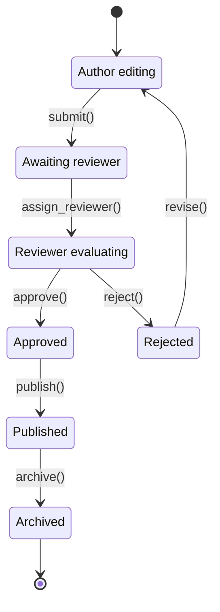

#### Composite States

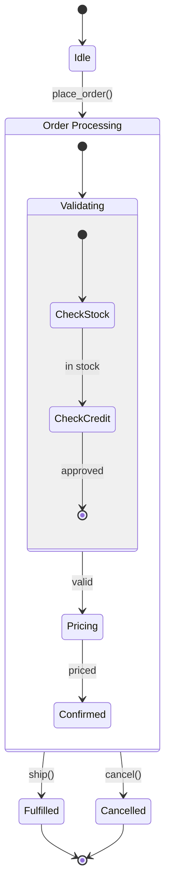

#### Parallel with Fork/Join

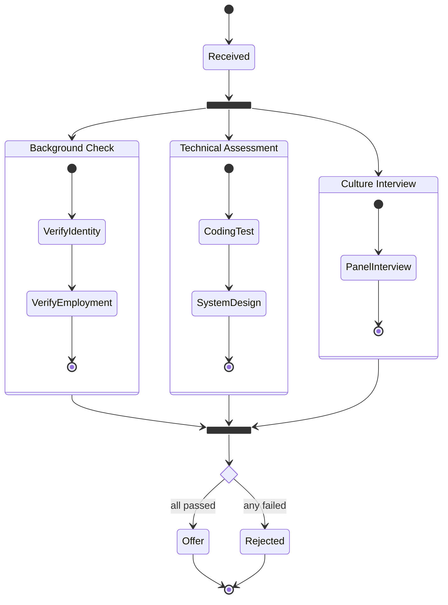

---

## Class Diagrams

### When to Use Class Diagrams

- Domain model documentation
- API type definitions
- Design pattern illustration
- Object-oriented architecture
- Type hierarchy documentation

### Strict Syntax Rules

1. **Visibility markers** (prefix on members):
   | Marker | Meaning |
   |--------|---------|
   | `+` | Public |
   | `-` | Private |
   | `#` | Protected |
   | `~` | Package/Internal |

2. **Method classifiers** (suffix on methods):
   | Marker | Meaning |
   |--------|---------|
   | `*` | Abstract |
   | `$` | Static |

3. **Relationship arrows** (memorize direction and meaning):
   | Arrow | Meaning | Read as |
   |-------|---------|---------|
   | `A <\|-- B` | Inheritance | B extends A |
   | `A <\|.. B` | Implementation | B implements A |
   | `A *-- B` | Composition | A owns B (B dies with A) |
   | `A o-- B` | Aggregation | A has B (B can exist alone) |
   | `A --> B` | Association | A uses B |
   | `A ..> B` | Dependency | A depends on B |
   | `A -- B` | Link | A related to B |

4. **Generics** — Use tilde: `List~T~`, `Map~K, V~` (NOT angle brackets `<T>`)
5. **Annotations** — Use `<<interface>>`, `<<abstract>>`, `<<enumeration>>`, `<<service>>`
6. **Cardinality** — Add to relationships: `A "1" --> "*" B`
7. **Namespace** — Group classes with `namespace`:
   ```
   namespace Domain {
       class Order
       class Product
   }
   ```

### Common Pitfalls and Anti-Patterns

| Pitfall | Problem | Fix |
|---------|---------|-----|
| Angle brackets for generics | `List<T>` breaks Mermaid | Use `List~T~` with tildes |
| Composition vs aggregation confusion | Wrong diamond type | Composition (filled `*`): part dies with whole. Aggregation (hollow `o`): part survives |
| Too many classes | >12 classes is unreadable | Split into domain-focused diagrams |
| Missing visibility | No `+`/`-` prefix | Always specify visibility for real designs |
| Enum as class | Using `class Status` for enums | Use `<<enumeration>>` annotation |
| Methods without return types | `+process()` | `+process() void` or `+process() Order` |
| Bidirectional arrows | `A <--> B` | Use two separate arrows with different labels |

### Complete Examples

#### Simple Hierarchy

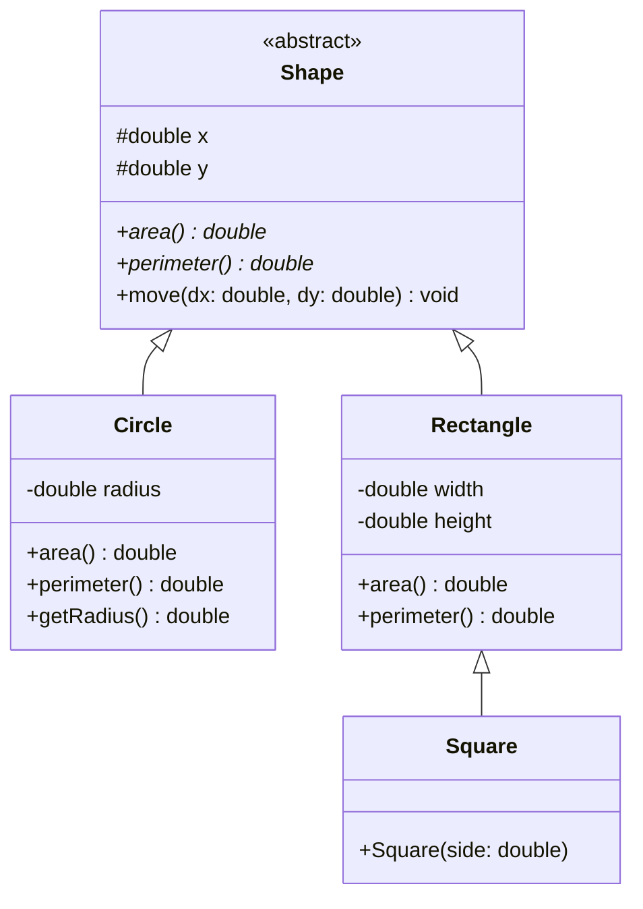

#### Domain Model

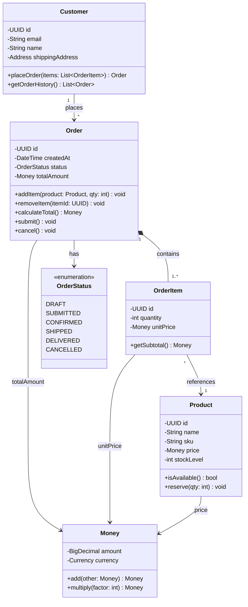

#### Design Pattern — Observer

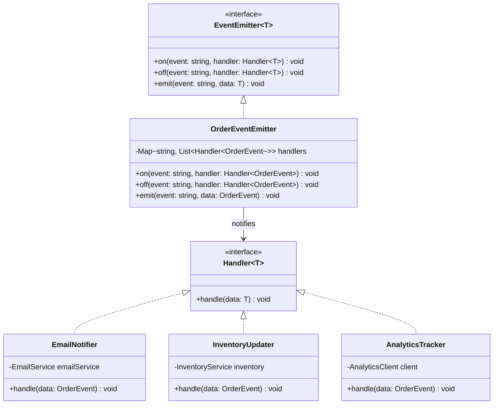

---

## ER Diagrams

### When to Use ER Diagrams

- Database schema documentation
- Data model design
- API response type relationships
- Domain entity mapping
- Migration planning

### Strict Syntax Rules

1. **Entity definition** with typed attributes:
   ```
   ENTITY_NAME {
       type attribute_name PK/FK/UK "comment"
   }
   ```
2. **Attribute key markers**:
   | Marker | Meaning |
   |--------|---------|
   | `PK` | Primary Key |
   | `FK` | Foreign Key |
   | `UK` | Unique Key |

3. **Crow's foot cardinality symbols**:
   | Symbol | Meaning |
   |--------|---------|
   | `\|\|` | Exactly one |
   | `o\|` | Zero or one |
   | `\|{` | One or more |
   | `o{` | Zero or more |

4. **Relationship lines**:
   | Style | Meaning |
   |-------|---------|
   | Solid (`--`) | Identifying relationship (child depends on parent) |
   | Dashed (`..`) | Non-identifying relationship (both can exist independently) |

5. **Relationship labels** — Always use quoted strings: `ENTITY_A \|\|--o{ ENTITY_B : "has many"`
6. **Entity names** — UPPER_SNAKE_CASE by convention

### How to Read Cardinality

Read from the entity outward toward the line:

```
CUSTOMER ||--o{ ORDER : "places"
```

- Left side (CUSTOMER): `||` = exactly one customer
- Right side (ORDER): `o{` = zero or more orders
- Reads: "One customer places zero or more orders"

**Critical:** `{` and `}` look directional but they always mean "many":
- `o{` on the right = zero-or-more
- `}o` on the left = zero-or-more

### Common Pitfalls and Anti-Patterns

| Pitfall | Problem | Fix |
|---------|---------|-----|
| Missing relationship label | Diagram won't render | Always add `: "label"` with quotes |
| `{`/`}` confusion | Getting cardinality backwards | `{` = many (right side), `}` = many (left side) |
| Methods on entities | ER is for data, not behavior | Only include data attributes |
| Missing PK/FK annotations | Schema is ambiguous | Always mark PK, FK, and UK |
| Attribute types don't match DB | Using `String` instead of `varchar` | Use actual DB types: `uuid`, `varchar`, `int`, `timestamp`, `text`, `jsonb` |
| Too many entities | >10 entities is unreadable | Split into domain-bounded diagrams |
| No FK for relationships | Relationship shown but FK missing | Add FK attribute matching the relationship |

### Complete Examples

#### 3-Entity Blog

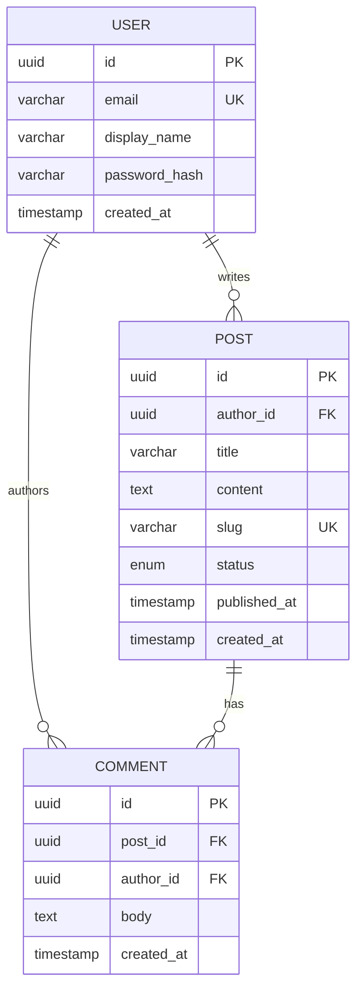

#### E-Commerce Schema

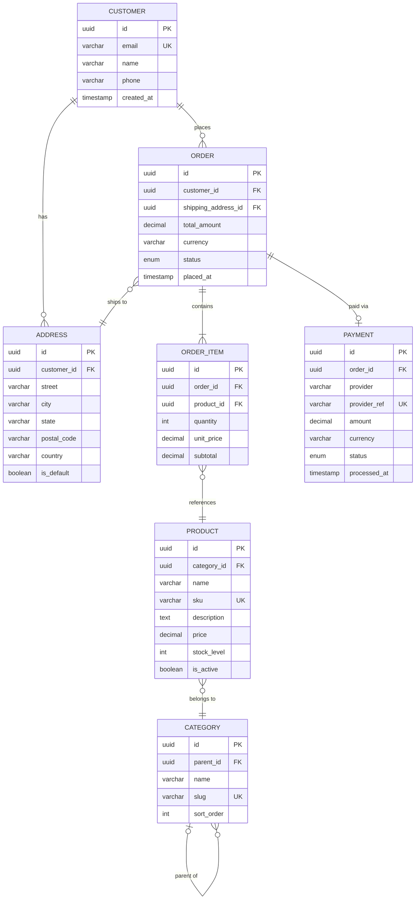

#### Multi-Tenant SaaS

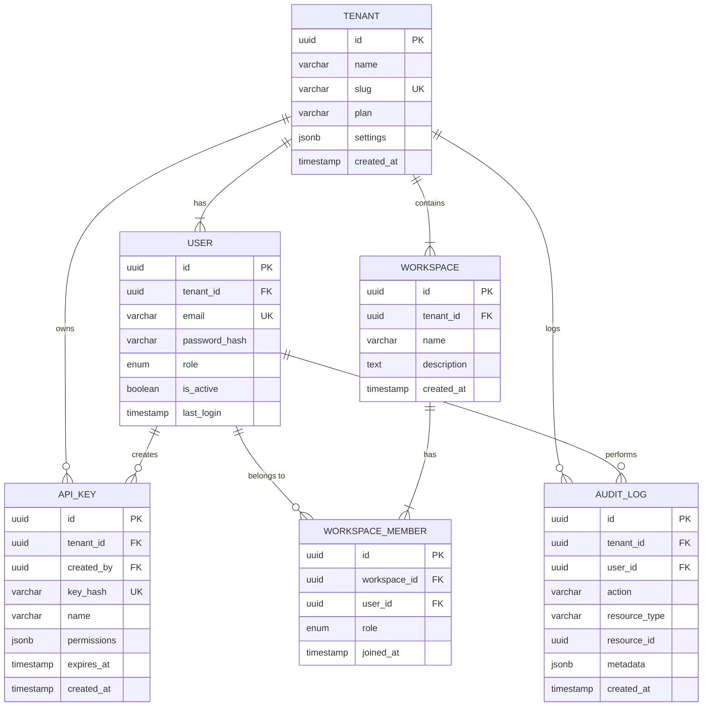

---

## Gantt Charts

### When to Use Gantt Charts

- Project roadmaps and timelines
- Sprint planning visualization
- Release scheduling
- Dependency tracking between work items
- Milestone tracking

### Strict Syntax Rules

1. **Declaration** — Start with `gantt`
2. **Date format** — `dateFormat YYYY-MM-DD` (REQUIRED — always include)
3. **Axis format** — `axisFormat %Y-%m-%d` (optional, controls x-axis labels)
4. **Sections** — `section Section Name` (group tasks)
5. **Task syntax**:
   ```
   Task Name :status, id, start, duration
   Task Name :status, id, after dep_id, duration
   ```
   Where status is one of: `done`, `active`, `crit`, or omitted for default.
6. **Dependencies** — `after task_id` references a previous task's id
7. **Milestones** — `Milestone Name :milestone, id, after dep_id, 0d`
8. **Excludes** — `excludes weekends` or `excludes 2024-12-25`

### Task Status Markers

| Marker | Meaning | Visual |
|--------|---------|--------|
| `done` | Completed | Filled/dark |
| `active` | In progress | Highlighted |
| `crit` | Critical path | Red/emphasized |
| (none) | Future/planned | Default style |

### Common Pitfalls and Anti-Patterns

| Pitfall | Problem | Fix |
|---------|---------|-----|
| Missing `dateFormat` | Dates won't parse | Always include `dateFormat YYYY-MM-DD` |
| Commas in task names | Mermaid misparses the task | Avoid commas in names, or restructure |
| Circular dependencies | `a after b`, `b after a` | Review dependency chain for cycles |
| Non-zero milestone | `Milestone :milestone, m1, after t1, 5d` | Milestones must be `0d` |
| No task IDs | Can't reference dependencies | Always assign IDs: `:done, taskId, start, dur` |
| Overlapping sections | Tasks in wrong section visually | Ensure tasks are listed under correct `section` |
| Invalid date format | Using `MM/DD/YYYY` or `DD-MM-YYYY` | Match the declared `dateFormat` exactly |
| Missing `after` keyword | `task :t2, t1, 5d` (ambiguous) | Use `task :t2, after t1, 5d` explicitly |

### Complete Examples

#### Simple Project

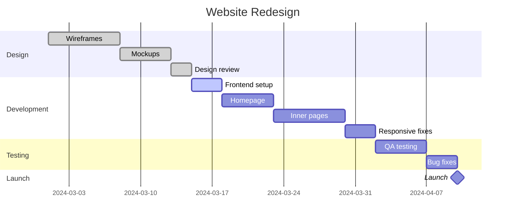

#### Multi-Section with Dependencies

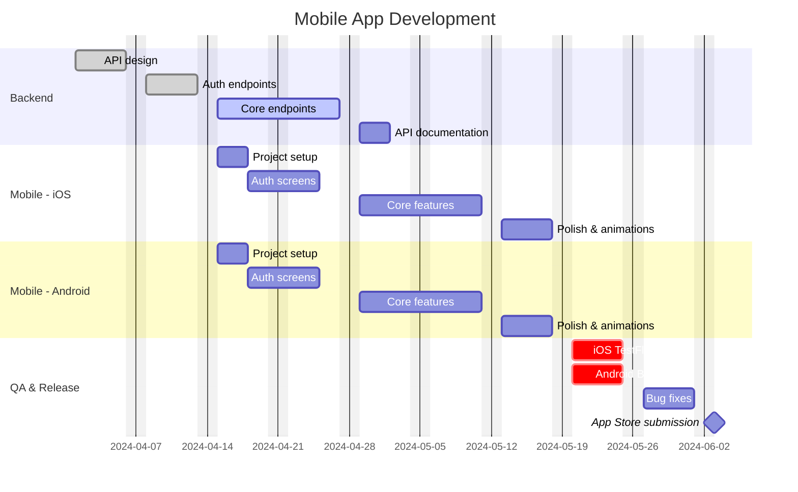

#### Sprint Roadmap

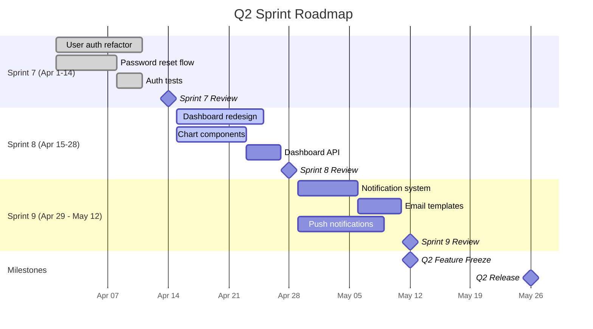

---

*This reference is part of the docs-with-mermaid Vista skill. For basic syntax, see [mermaid-reference.md](mermaid-reference.md). For practical examples, see [examples.md](examples.md).*
