# PlantUML Format Reference

> Complete reference for creating PlantUML diagrams in Vista.
> Use PlantUML when Mermaid syntax is too limiting — especially for deployment diagrams, complex activity diagrams with swim lanes, and detailed UML with notes on associations.

## Table of Contents

- [File Format](#file-format)
- [When to Choose PlantUML over Mermaid](#when-to-choose-plantuml-over-mermaid)
- [Sequence Diagrams](#sequence-diagrams)
- [Class Diagrams](#class-diagrams)
- [Activity Diagrams](#activity-diagrams)
- [Component Diagrams](#component-diagrams)
- [Deployment Diagrams](#deployment-diagrams)
- [Use Case Diagrams](#use-case-diagrams)
- [State Diagrams](#state-diagrams)
- [Object Diagrams](#object-diagrams)
- [Timing Diagrams](#timing-diagrams)
- [Preprocessing and Includes](#preprocessing-and-includes)
- [Styling with skinparam](#styling-with-skinparam)
- [Vista Integration](#vista-integration)

---

## File Format

- **Extension:** `.puml`
- **Wrapper:** Every diagram MUST be wrapped in `@startuml` / `@enduml`
- **Comments:** Single line `' comment` or block `/' comment '/`
- **Encoding:** UTF-8

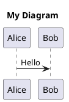

---

## When to Choose PlantUML over Mermaid

| Feature | Mermaid | PlantUML | Recommendation |
|---------|---------|----------|----------------|
| Deployment diagrams | Not supported | Full support | **PlantUML** |
| Activity swim lanes | Not supported | Full support | **PlantUML** |
| Notes on associations | Limited | Full support | **PlantUML** |
| `!include` modularity | Not supported | Full support | **PlantUML** |
| C4 Deployment level | Not supported | Via C4-PlantUML | **PlantUML** |
| Timing diagrams | Not supported | Full support | **PlantUML** |
| Object diagrams | Not supported | Full support | **PlantUML** |
| Browser rendering | Native JS | Requires server | **Mermaid** |
| GitHub/GitLab native | Yes | No | **Mermaid** |
| Simpler syntax | Yes | No | **Mermaid** |

**Rule of thumb:** Default to Mermaid. Switch to PlantUML when you need a diagram type or feature Mermaid doesn't support.

---

## Sequence Diagrams

PlantUML sequence diagrams support the same concepts as Mermaid but with richer features.

### Basic Syntax

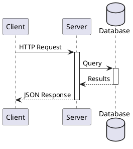

### Participant Types

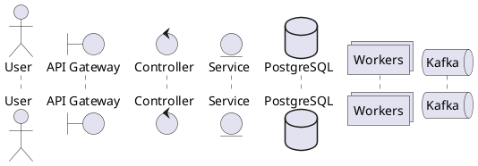

### Arrow Types

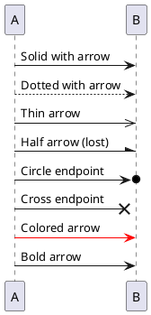

### Control Flow

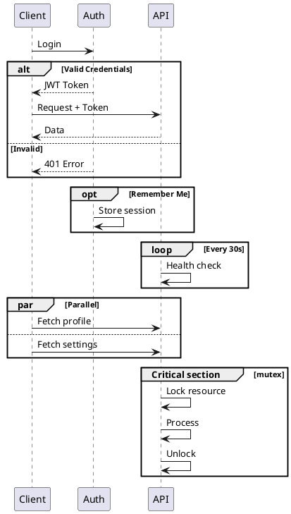

### Notes

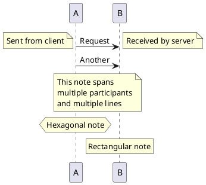

### Advanced Features

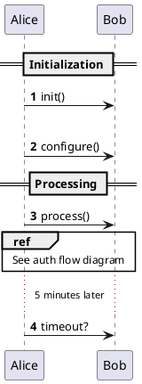

---

## Class Diagrams

### Basic Syntax

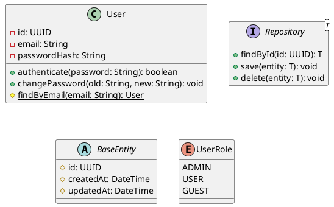

### Visibility Modifiers

| Symbol | Meaning |
|--------|---------|
| `-` | Private |
| `#` | Protected |
| `~` | Package |
| `+` | Public |

### Relationships

```plantuml
@startuml
' Inheritance
Animal <|-- Dog
Animal <|-- Cat

' Implementation
Serializable <|.. User

' Composition (filled diamond)
Car *-- Engine
Car *-- "4" Wheel

' Aggregation (hollow diamond)
University o-- Student

' Association
Teacher --> Student: teaches

' Dependency
Client ..> Service: uses

' Note on relationship
(Teacher, Student) .. teaches_note
note "Max 30 students\nper teacher" as teaches_note
@enduml
```

### Notes and Constraints

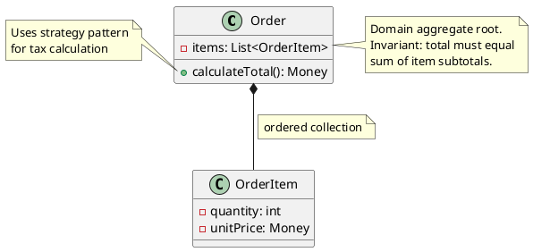

### Packages and Namespaces

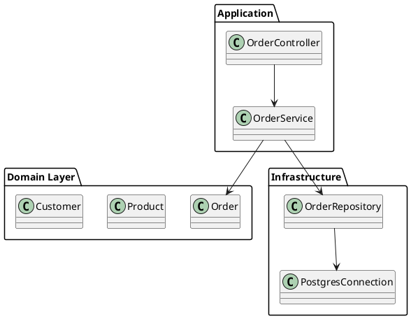

---

## Activity Diagrams

PlantUML activity diagrams support swim lanes — a key advantage over Mermaid.

### Basic Syntax

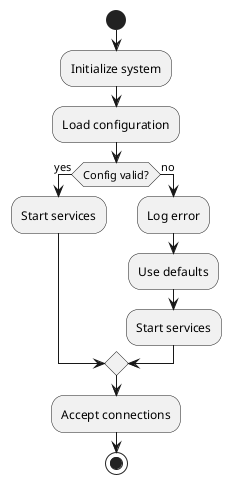

### Swim Lanes

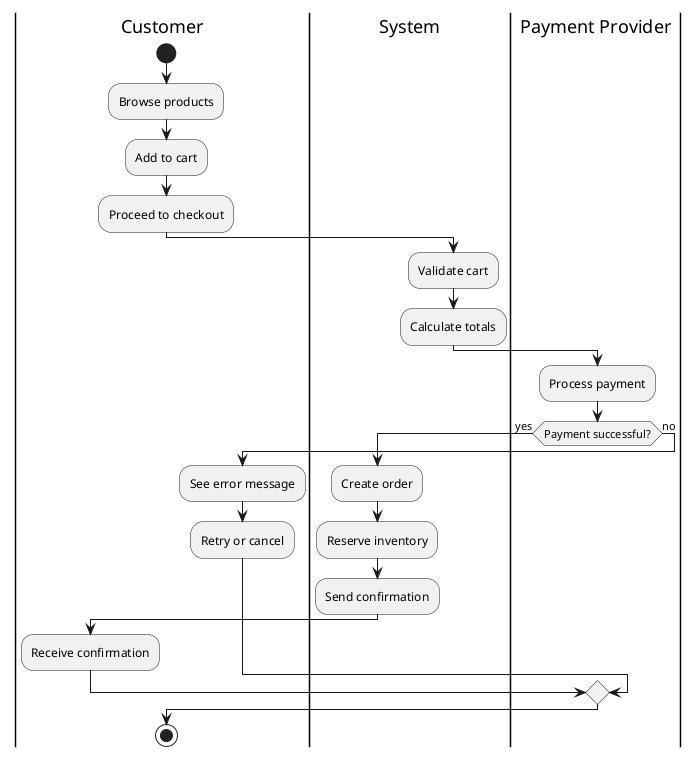

### Control Flow

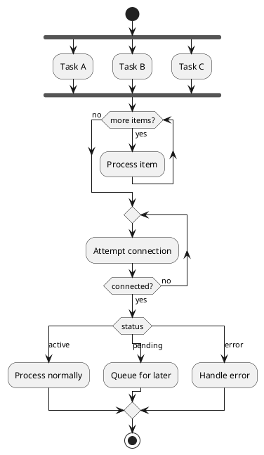

### Partitions and Colors

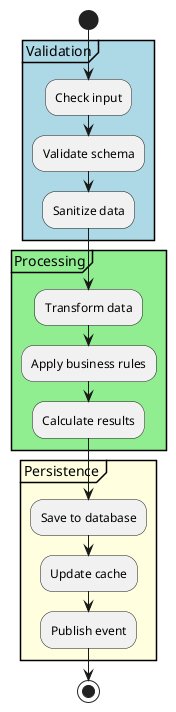

---

## Component Diagrams

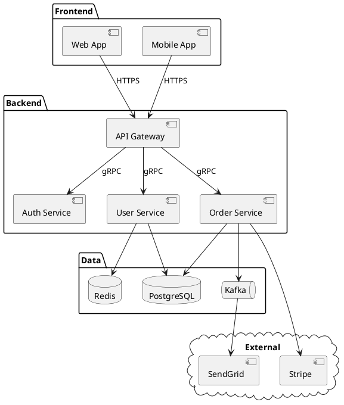

---

## Deployment Diagrams

This is PlantUML's killer feature — Mermaid has no equivalent.

### Basic Deployment

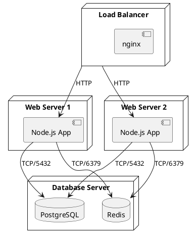

### Cloud Deployment

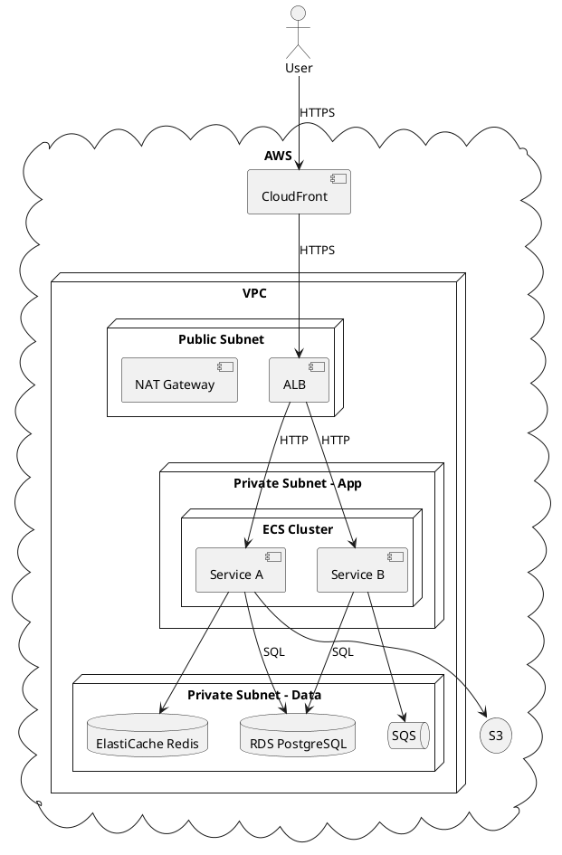

### Kubernetes Deployment

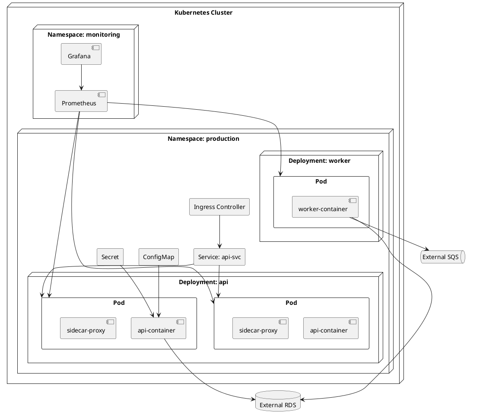

---

## Use Case Diagrams

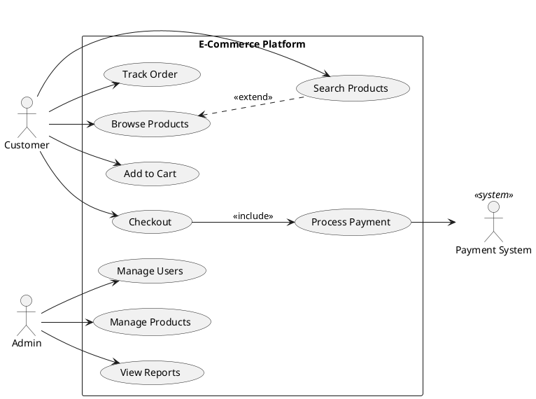

---

## State Diagrams

```plantuml
@startuml
[*] --> Draft

state Draft {
    [*] --> Editing
    Editing --> Saving: auto-save
    Saving --> Editing: saved
}

Draft --> Submitted: submit()
Submitted --> InReview: assign_reviewer()

state InReview {
    [*] --> Reading
    Reading --> Commenting: add_comment()
    Commenting --> Reading: done
}

InReview --> Approved: approve()
InReview --> Rejected: reject()
Rejected --> Draft: revise()

state Approved {
    [*] --> Scheduling
    Scheduling --> Queued: schedule()
}

Approved --> Published: publish()
Published --> Archived: archive()
Archived --> [*]

note right of Draft: Author working
note right of InReview: Reviewer feedback loop
note right of Approved: Ready for publication
@enduml
```

---

## Object Diagrams

Object diagrams show instances at a specific point in time — useful for illustrating runtime state.

```plantuml
@startuml
object "order1: Order" as o1 {
    id = "ORD-001"
    status = CONFIRMED
    total = $149.97
    createdAt = "2024-03-15"
}

object "item1: OrderItem" as i1 {
    quantity = 2
    unitPrice = $49.99
}

object "item2: OrderItem" as i2 {
    quantity = 1
    unitPrice = $49.99
}

object "product1: Product" as p1 {
    name = "Widget Pro"
    sku = "WDG-001"
}

object "product2: Product" as p2 {
    name = "Gadget Plus"
    sku = "GDG-002"
}

o1 *-- i1
o1 *-- i2
i1 --> p1: references
i2 --> p2: references
@enduml
```

---

## Timing Diagrams

Timing diagrams show state changes over time — ideal for protocol documentation.

```plantuml
@startuml
robust "Web Server" as WS
concise "Client" as C
clock clk with period 1

@0
WS is Idle
C is Idle

@1
C is Requesting
WS is Idle

@2
WS is Processing
C is Waiting

@4
WS is Responding
C is Waiting

@5
C is Receiving
WS is Idle

@7
C is Idle
WS is Idle

highlight 2 to 4 #LightGreen: Server processing time
highlight 1 to 5 #LightBlue: Total request lifecycle
@enduml
```

---

## Preprocessing and Includes

PlantUML includes a preprocessor for reusable diagram components.

### Variables and Macros

```plantuml
@startuml
!define PRIMARY_COLOR #4A90D9
!define SUCCESS_COLOR #7ED321
!define ERROR_COLOR #D0021B

!define SERVICE(name, desc) rectangle name as name <<service>> #PRIMARY_COLOR [desc]
!define DATABASE(name, desc) database name as name <<database>> [desc]

SERVICE(auth, "Auth Service")
SERVICE(api, "API Service")
DATABASE(db, "PostgreSQL")

auth --> api
api --> db
@enduml
```

### File Includes

```plantuml
@startuml
' Include shared styles
!include styles/theme.puml

' Include partial diagrams
!include components/auth-module.puml
!include components/api-module.puml

' Conditional inclusion
!ifdef SHOW_DETAILS
    !include components/internals.puml
!endif
@enduml
```

### Themes

```plantuml
@startuml
!theme cerulean
' Available themes: cerulean, materia, minty, sandstone, superhero, united, etc.

class MyClass {
    +method(): void
}
@enduml
```

---

## Styling with skinparam

`skinparam` controls the visual appearance of every diagram element.

### Global Styling

```plantuml
@startuml
skinparam backgroundColor #FEFEFE
skinparam defaultFontName "Segoe UI"
skinparam defaultFontSize 12
skinparam shadowing false
skinparam roundcorner 8

skinparam class {
    BackgroundColor #E1F5FE
    BorderColor #0288D1
    ArrowColor #01579B
    FontColor #01579B
}

skinparam package {
    BackgroundColor #F3E5F5
    BorderColor #7B1FA2
}

skinparam note {
    BackgroundColor #FFF9C4
    BorderColor #F9A825
}
@enduml
```

### Component-Specific Styling

```plantuml
@startuml
skinparam component {
    BackgroundColor #E8F5E9
    BorderColor #2E7D32
    FontColor #1B5E20
}

skinparam database {
    BackgroundColor #FFF3E0
    BorderColor #E65100
}

skinparam queue {
    BackgroundColor #E3F2FD
    BorderColor #1565C0
}

skinparam arrow {
    Color #37474F
    FontColor #546E7A
    Thickness 1.5
}
@enduml
```

### Common skinparam Properties

| Property | Applies To | Example |
|----------|-----------|---------|
| `BackgroundColor` | All elements | `#E1F5FE` |
| `BorderColor` | All elements | `#0288D1` |
| `FontColor` | All elements | `#01579B` |
| `FontSize` | All elements | `14` |
| `FontName` | All elements | `"Arial"` |
| `ArrowColor` | Relationships | `#333333` |
| `ArrowThickness` | Relationships | `2` |
| `Shadowing` | Global | `false` |
| `RoundCorner` | Rectangles | `10` |
| `Padding` | Containers | `10` |
| `LineType` | Relationships | `ortho` |

---

## Vista Integration

### Rendering

PlantUML diagrams are rendered server-side via a PlantUML server. The server URL is configurable in Vista settings.

The rendering pipeline:
1. Vista reads the `.puml` file content
2. Encodes it using PlantUML's deflate encoding
3. Sends to the PlantUML server (default: `https://www.plantuml.com/plantuml`)
4. Receives SVG/PNG back for display

The `plantuml-encoder` CDN (~10KB) handles client-side encoding.

### Manifest Configuration

In `_arch.json`:

```json
{
    "diagrams": [
        {
            "id": "deployment-diagram",
            "title": "Production Deployment",
            "file": "deployment.puml",
            "type": "plantuml",
            "diagramType": "custom"
        }
    ]
}
```

- **`type`**: Must be `"plantuml"`
- **`diagramType`**: Use `"custom"` for all PlantUML diagrams

### File Organization

Place PlantUML files in the architecture directory:
```
docs/<feature>/arch/
├── _arch.json
├── overview.mmd          (Mermaid for simple diagrams)
├── deployment.puml       (PlantUML for deployment)
├── activity-swim.puml    (PlantUML for swim lanes)
└── README.md             (Prose documentation)
```

### Best Practices

1. **Use PlantUML only when Mermaid can't do the job** — Mermaid is simpler and renders client-side
2. **Include `@startuml`/`@enduml`** — Always wrap content; Vista strips these for encoding
3. **Use `skinparam shadowing false`** — Shadows render poorly in small viewports
4. **Keep font sizes ≥ 12** — PlantUML server renders at fixed resolution
5. **Prefer SVG output** — Better scaling than PNG in the dashboard
6. **Break large diagrams** — PlantUML server has URL length limits (~8000 chars encoded)

---

*This reference is part of the docs-with-mermaid Vista skill. For Mermaid diagrams, see [mermaid-reference.md](mermaid-reference.md) and [mermaid-advanced.md](mermaid-advanced.md).*
