# PlantUML Reference for AI Agents

## When to Use PlantUML

### Advantages Over Mermaid
- **Network topology diagrams** (nwdiag) - superior for multi-interface devices, VLANs, and physical network layouts
- **Component diagrams** - better interface notation (lollipop/socket), ports, and hardware modeling
- **Deployment diagrams** - richer node and artifact representation
- **Wireframes** - salt syntax for UI mockups
- **Standard library** - built-in AWS, Azure, GCP icons
- **Advanced styling** - CSS-style themes and skinparam customization

### Best Use Cases
- Network architecture with multiple subnets and interfaces
- Hardware/IoT system architecture (sensors, microcontrollers, interfaces)
- Server rack and physical deployment layouts
- Component interactions with explicit interface contracts
- UI wireframes and mockups

---

## Network Diagrams (nwdiag)

### Basic Syntax
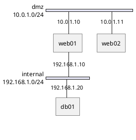

### Multi-Interface Devices
Devices appearing in multiple networks automatically get multiple interfaces:

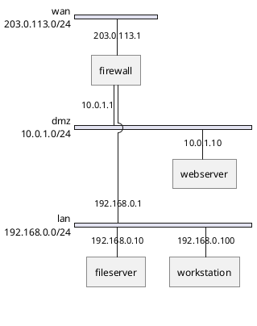

### VLAN Grouping
Use `group` to visually separate VLANs or logical segments:

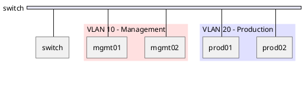

### Network Properties
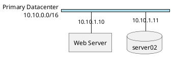

**Available shapes**: `box`, `cloud`, `database`, `actor`, `node`, `folder`, `frame`, `storage`, `component`

---

## Component Diagrams

### Interface Notation
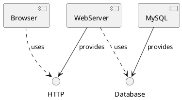

**Lollipop (provided) vs Socket (required)**:
- `-->` from component = provides interface (lollipop)
- `..>` to interface = requires/uses interface (socket)

### Ports and Nested Components
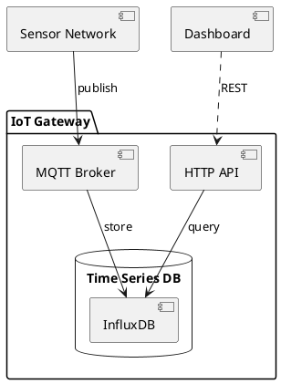

### Hardware/IoT Example
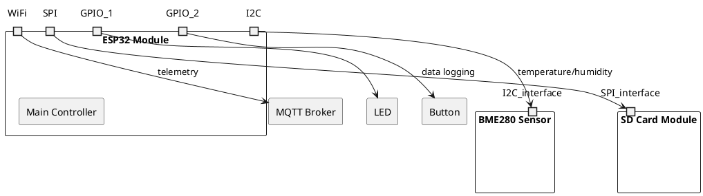

### Stereotypes
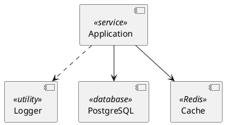

---

## Deployment Diagrams

### Basic Node Structure
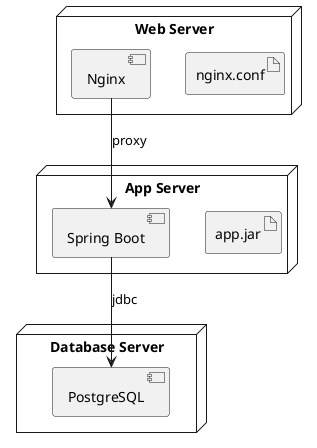

### Nested Nodes (Server Rack Example)
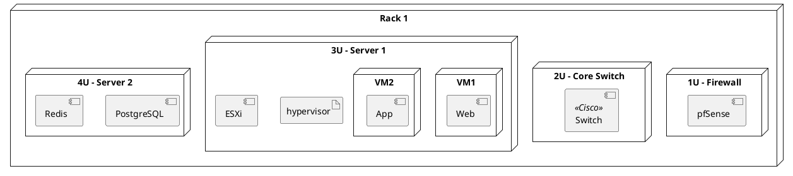

### Cloud Deployment
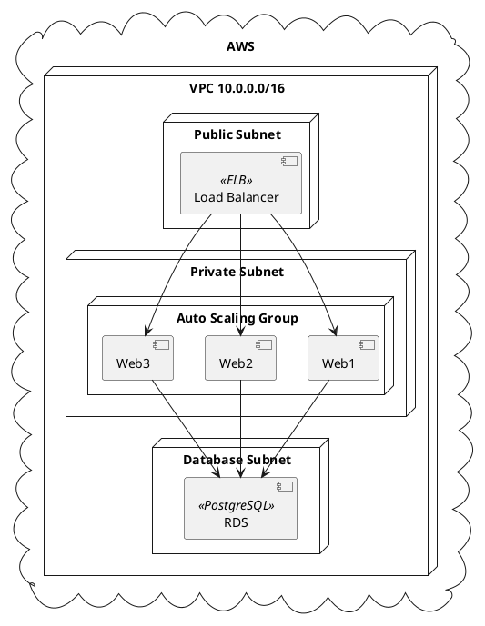

---

## Arrow Types Reference

| Syntax | Description | Visual |
|--------|-------------|--------|
| `-->` | Solid arrow | ──────> |
| `..>` | Dotted arrow | ┈┈┈┈┈> |
| `--` | Solid line (no arrow) | ────── |
| `..` | Dotted line (no arrow) | ┈┈┈┈┈┈ |
| `<-->` | Bidirectional solid | <────> |
| `<..>` | Bidirectional dotted | <┈┈┈> |
| `-down->` | Force direction | ↓ |
| `-up->` | Force direction | ↑ |
| `-left->` | Force direction | ← |
| `-right->` | Force direction | → |
| `-[bold]->` | Bold arrow | ━━━━━> |
| `-[dashed]->` | Dashed arrow | ─ ─ ─> |
| `-[dotted]->` | Dotted arrow | ┈┈┈┈┈> |
| `-[hidden]->` | Invisible (spacing) | (none) |
| `-[#red]->` | Colored arrow | (red) |
| `-[thickness=4]->` | Thick arrow | ━━━━━> |

### Arrow with Labels
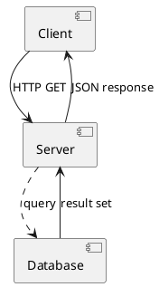

---

## Styling

### Modern CSS-Style (Recommended)
```plantuml
@startuml
<style>
node {
  BackgroundColor lightblue
  BorderColor navy
  FontSize 14
  FontColor darkblue
}

component {
  BackgroundColor lightyellow
  BorderColor orange
  RoundCorner 15
}

database {
  BackgroundColor lightgreen
  BorderColor darkgreen
}
</style>

node "Server" {
  component [App]
  database [DB]
}
@enduml
```

### Legacy skinparam
```plantuml
@startuml
skinparam node {
  BackgroundColor lightblue
  BorderColor navy
  FontSize 14
}

skinparam component {
  BackgroundColor lightyellow
  BorderColor orange
  Style rectangle
}

skinparam database {
  BackgroundColor lightgreen
  BorderColor darkgreen
}

node "Server" {
  component [App]
  database [DB]
}
@enduml
```

### Common skinparam Options
```plantuml
@startuml
skinparam monochrome true
skinparam shadowing false
skinparam defaultFontName Arial
skinparam defaultFontSize 12
skinparam backgroundColor white
skinparam ArrowColor black
@enduml
```

---

## Standard Library (Icons)

### AWS Icons
```plantuml
@startuml
!include <awslib/AWSCommon>
!include <awslib/Compute/EC2>
!include <awslib/Database/RDS>
!include <awslib/Storage/S3>
!include <awslib/NetworkingContentDelivery/ELB>

ELB(lb, "Load Balancer", "Application LB")
EC2(web1, "Web Server 1", "t3.medium")
EC2(web2, "Web Server 2", "t3.medium")
RDS(db, "Database", "PostgreSQL")
S3(storage, "Static Assets", "S3 Bucket")

lb --> web1
lb --> web2
web1 --> db
web2 --> db
web1 --> storage
web2 --> storage
@enduml
```

### Azure Icons
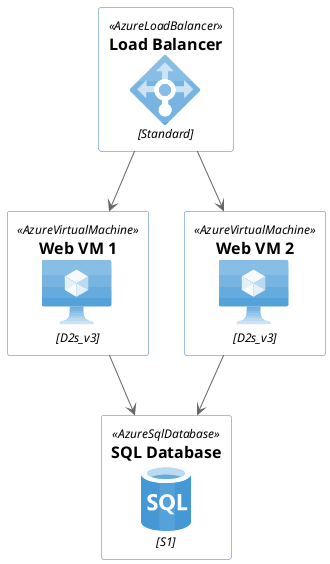

---

## Rendering Methods

### 1. CLI (Local Java)
```bash
# Install PlantUML
wget https://github.com/plantuml/plantuml/releases/download/v1.2024.0/plantuml-1.2024.0.jar

# Render diagram
java -jar plantuml.jar diagram.puml

# Specify output format
java -jar plantuml.jar -tsvg diagram.puml
java -jar plantuml.jar -tpng diagram.puml
java -jar plantuml.jar -tpdf diagram.puml
```

### 2. Docker Server
```bash
# Run PlantUML server
docker run -d -p 8080:8080 plantuml/plantuml-server:jetty

# Access at http://localhost:8080
```

### 3. Public HTTP API
**Encode and render via URL**:

Base URL: `https://www.plantuml.com/plantuml/svg/`

```python
import zlib
import base64

def encode_plantuml(source):
    """Encode PlantUML source for URL"""
    compressed = zlib.compress(source.encode('utf-8'))[2:-4]
    return base64.urlsafe_b64encode(compressed).decode('ascii')

source = """
@startuml
Alice -> Bob: Hello
@enduml
"""

encoded = encode_plantuml(source)
url = f"https://www.plantuml.com/plantuml/svg/{encoded}"
print(url)
```

**Direct POST** (if server supports):
```bash
curl -X POST --data-binary @diagram.puml https://www.plantuml.com/plantuml/svg/ > output.svg
```

### 4. Output Formats
- **SVG** (`-tsvg`) - scalable, recommended for web
- **PNG** (`-tpng`) - raster, good for documents
- **PDF** (`-tpdf`) - print-ready
- **LaTeX** (`-tlatex`) - integration with TeX
- **ASCII Art** (`-ttxt`) - terminal-friendly

---

## Rack Diagrams (Limitation & Workaround)

### No Native Rack Support
PlantUML does **not** have dedicated rack diagram syntax (unlike specialized tools like rackdiag). However, you can approximate rack layouts using deployment diagrams.

### Workaround: Deployment Diagram
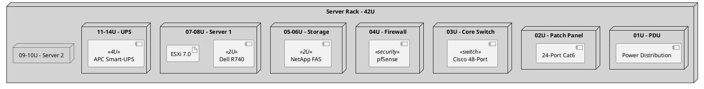

**Tip**: For true rack diagrams with U-measurements and rear/front views, use specialized tools or consider generating ASCII-art representations.

---

## Practical Examples

### Example 1: Multi-VLAN Network Topology
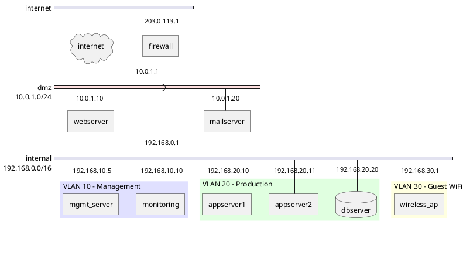

### Example 2: IoT Device Architecture
```plantuml
@startuml
skinparam componentStyle rectangle

package "Edge Device - ESP32" {
  component "Main MCU" {
    port WiFi
    port GPIO
    port I2C
    port SPI
    port UART
  }

  component [BME280] <<I2C Sensor>> {
    port I2C_bus
  }

  component [SD Card] <<SPI Storage>> {
    port SPI_bus
  }

  component [GPS Module] <<UART>> {
    port UART_bus
  }

  I2C --> I2C_bus : temp/humidity/pressure
  SPI --> SPI_bus : data logging
  UART --> UART_bus : location
  GPIO --> [LED Indicator]
  GPIO --> [Reset Button]
}

cloud "AWS IoT Core" {
  component [MQTT Broker]
  component [IoT Rules Engine]
  database [DynamoDB]
  component [Lambda]
}

WiFi --> [MQTT Broker] : TLS 1.2
[MQTT Broker] --> [IoT Rules Engine]
[IoT Rules Engine] --> [DynamoDB] : store
[IoT Rules Engine] --> [Lambda] : trigger
@enduml
```

### Example 3: Microcontroller Pinout
```plantuml
@startuml
skinparam componentStyle rectangle

component "Arduino Mega 2560" {
  port "D0 (RX0)" as d0
  port "D1 (TX0)" as d1
  port "D2 (INT0)" as d2
  port "D3 (PWM)" as d3
  port "D13 (LED)" as d13
  port "A0 (ADC)" as a0
  port "A1 (ADC)" as a1
  port "SDA (20)" as sda
  port "SCL (21)" as scl
  port "5V" as v5
  port "GND" as gnd

  [ATmega2560]
}

component [LCD Display] {
  port SDA_lcd
  port SCL_lcd
  port VCC
  port GND_lcd
}

component [Ultrasonic Sensor] {
  port TRIG
  port ECHO
  port VCC_us
  port GND_us
}

component [Servo Motor] {
  port SIGNAL
  port VCC_servo
  port GND_servo
}

sda --> SDA_lcd
scl --> SCL_lcd
v5 --> VCC
gnd --> GND_lcd

d2 --> TRIG
d3 --> ECHO
v5 --> VCC_us
gnd --> GND_us

d13 --> SIGNAL
v5 --> VCC_servo
gnd --> GND_servo
@enduml
```

### Example 4: Data Center Deployment
```plantuml
@startuml
node "Data Center A" {
  node "DMZ Zone" {
    component [Load Balancer 1] <<F5>>
    component [Load Balancer 2] <<F5>>
  }

  node "Web Tier" {
    component [Web1]
    component [Web2]
    component [Web3]
  }

  node "App Tier" {
    component [App1]
    component [App2]
  }

  node "Data Tier" {
    database [Primary DB] <<PostgreSQL>>
    database [Replica DB] <<PostgreSQL>>
    database [Cache] <<Redis>>
  }
}

node "Data Center B (DR)" {
  database [Standby DB] <<PostgreSQL>>
}

[Load Balancer 1] --> [Web1]
[Load Balancer 1] --> [Web2]
[Load Balancer 2] --> [Web2]
[Load Balancer 2] --> [Web3]

[Web1] --> [App1]
[Web2] --> [App1]
[Web2] --> [App2]
[Web3] --> [App2]

[App1] --> [Primary DB]
[App1] --> [Cache]
[App2] --> [Primary DB]
[App2] --> [Cache]

[Primary DB] ..> [Replica DB] : streaming replication
[Primary DB] ..> [Standby DB] : async replication
@enduml
```

---

## Quick Tips for AI Agents

1. **Network diagrams**: Always use `nwdiag` for multi-subnet topologies
2. **Hardware/IoT**: Component diagrams with ports are ideal
3. **Server racks**: Use nested deployment nodes with U-height in descriptions
4. **Interfaces**: Use `-->` for "provides", `..>` for "requires"
5. **Styling**: Prefer `<style>` blocks over `skinparam` for modern diagrams
6. **Icons**: Include AWS/Azure libraries when cloud architecture is involved
7. **File extension**: Always use `.puml` for PlantUML files
8. **Rendering**: Public API is fastest for one-off renders; local CLI for batch processing

