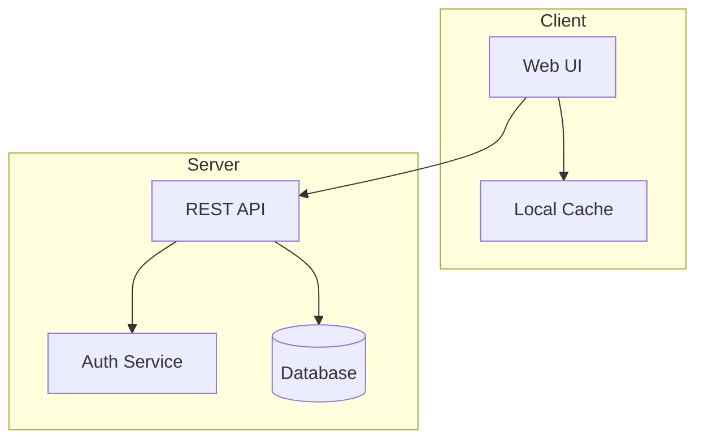
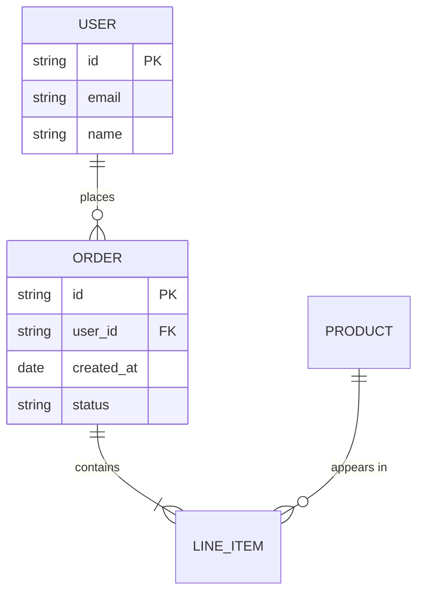

# Vista Plan

Plan a new feature through deep interactive questioning, producing domain requirements and architecture diagrams as the source of truth.

## Invocation

```
/vista:plan <feature-name>
```

## Prerequisites

- Project must be the current working directory
- Python 3.10+ available on PATH
- Feature name should be lowercase with hyphens (e.g., `user-auth`, `payment-flow`)

## Workflow

### Step 1: Scaffold and Explore

**1a. Scaffold the feature directory:**

```bash
python vista/scripts/setup-feature.py --name $ARGUMENTS
```

This creates `docs/<name>/` with:
- `domain-requirements.md` — Domain requirements template
- `specs/` — Specification documents directory (populated later by `/vista:specs`)
- `arch/` — Architecture diagrams directory with empty `_arch.json` manifest
- `progress.txt` — Progress tracking
- `IMPLEMENTATION_PLAN.md` — Implementation plan (populated by Ralph loops)

If the directory already exists, the script exits gracefully. Proceed to Step 1b.

**1b. Brief codebase exploration:**

Use subagents to quickly understand the project's existing patterns before asking questions.

- **Reference**: `vista/skills/plan/references/discovery-process.md`

Launch 1-3 Explore agents in parallel to discover:
- **Similar features**: Existing implementations in the same problem domain
- **Project structure**: Where source code lives, naming conventions, directory organization
- **Patterns in use**: State management, data access, API patterns, UI frameworks

Present a concise summary of findings to the user. This gives both you and the user shared context before diving into requirements.

### Step 2: Deep Interactive Questioning

This is the core of the plan skill. Use **AskUserQuestion** extensively — ask about every major area until the user is satisfied.

**Reference**: `vista/skills/plan/references/domain-requirements-template.md`

Work through these areas interactively:

#### 2a. Problem & Users
- What business problem are we solving?
- Who are the users? (roles, personas, skill levels)
- What pain points exist today?
- What outcomes do users expect?

#### 2b. Business Context
- What are the business objectives?
- What does success look like? (measurable metrics)
- Priority/urgency?

#### 2c. Functional Requirements
- What core functionality must this feature provide?
- What are the main user workflows? (walk through each step)
- What data needs to be created, read, updated, deleted?
- What business rules apply?

#### 2d. Non-Functional Requirements
- Performance expectations? (response times, throughput)
- Platform? (web, mobile, desktop, API-only)
- Offline/online requirements?
- Security concerns? (auth, data privacy, encryption)
- Accessibility requirements?

#### 2e. Constraints & Dependencies
- Technical constraints? (API limits, platform restrictions)
- Integration requirements? (external APIs, databases, third-party services)
- Dependencies on other features or systems?

#### 2f. Architecture Concepts
- What are the major components/services?
- How do they interact? (data flow, API calls, events)
- What data entities are involved and how do they relate?
- What are the key state transitions?

#### 2g. User Experience
- How do users discover this feature?
- What's the step-by-step user journey?
- What feedback mechanisms are needed? (loading states, confirmations, errors)
- What error scenarios need handling?

**Write answers incrementally** to `docs/<name>/domain-requirements.md` as each area is discussed. Don't wait until the end.

#### 2h. Flag TDD Candidates

As requirements emerge, identify components with heavy logic that would benefit from test-driven development. Look for:
- Complex calculations or algorithms
- State machines with many transitions
- Business rule engines with branching logic
- Data transformation pipelines
- Critical path components where bugs have high impact

Add a `## TDD Candidates` section at the end of `domain-requirements.md`:

```markdown
## TDD Candidates

- **[ComponentName]**: [reason — e.g., "Complex state machine with 8 states and 15 transitions"]
- **[ComponentName]**: [reason — e.g., "Pricing calculation with discount stacking rules"]
```

After questioning is complete, tell the user:
> Consider running `/vista:tdd <name>` to generate test-first diagrams for flagged components before proceeding to specs.

### Step 3: Generate Architecture Diagrams

Based on the completed `domain-requirements.md`, generate diagram files in `arch/`.

#### 3a. Determine which diagrams to create

Generate diagrams based on the requirements gathered. Default to Mermaid (`.mmd`) for all diagram types. Use alternative formats when they provide clear advantages:

| Diagram | File | When to Create |
|---------|------|----------------|
| System Architecture | `system-architecture.mmd` | Always — shows major components and relationships |
| User Flow | `user-flow.mmd` | Always — shows primary user journeys as flowchart |
| Data Model | `data-model.mmd` | When entities/data exist — ER diagram |
| Sequence Diagrams | `sequence-{flow}.mmd` | For each key interaction flow (typically 2-5) |
| State Diagrams | `state-{component}.mmd` | For stateful components (if any) |
| Design Rationale | `design-rationale.md` | Optional — prose documentation, ADRs, architecture decisions |

Not every feature needs every diagram type. Use judgment based on complexity.

**Supported formats:**

| Format | Extension | Best For | Rendering |
|--------|-----------|----------|-----------|
| Mermaid | `.mmd` | **Default** — all diagram types (flowchart, sequence, ER, state, etc.) | Client-side via mermaid.js |
| PlantUML | `.puml` | Optional — detailed UML class/sequence diagrams when Mermaid syntax is limiting | Server-side via PlantUML server |
| D2 | `.d2` | Optional — architecture diagrams with clean declarative syntax | Raw source (Kroki server optional) |
| Graphviz | `.dot` | Optional — dependency graphs, network topology diagrams | Client-side via viz.js WASM |
| Draw.io | `.drawio` | Optional — complex visual diagrams created with Draw.io editor | Iframe via viewer.diagrams.net |
| Markdown | `.md` | Optional — prose documentation, design rationale, ADRs | marked.js with inline editing |

#### 3b. Write diagram files

Each `.mmd` file must contain valid Mermaid syntax. Follow these conventions:

- Use clear, descriptive node labels
- Include notes where relationships are non-obvious
- Group related elements with subgraphs where helpful
- Keep diagrams focused — one concern per diagram

**Example system architecture:**


**Example ER diagram:**


#### 3c. Write the manifest

Update `arch/_arch.json` to reference all generated diagrams:

```json
{
  "feature": "<name>",
  "diagrams": [
    {
      "name": "System Architecture",
      "file": "system-architecture.mmd",
      "type": "mermaid",
      "diagramType": "flowchart",
      "category": "architecture",
      "description": "High-level system components and their relationships"
    },
    {
      "name": "User Flow",
      "file": "user-flow.mmd",
      "type": "mermaid",
      "diagramType": "flowchart",
      "category": "architecture",
      "description": "Primary user journey through the feature"
    },
    {
      "name": "Design Rationale",
      "file": "design-rationale.md",
      "type": "markdown",
      "diagramType": "custom",
      "category": "architecture",
      "description": "Architecture decisions and design rationale"
    }
  ]
}
```

The manifest must conform to `vista/templates/arch-schema.json`. Valid `type` values: `mermaid`, `drawio`, `plantuml`, `d2`, `graphviz`, `markdown`. Non-mermaid types should use `diagramType: "custom"`.

#### 3d. Report to user

Discover the dashboard URL by calling the `ralph_providers` MCP tool and reading `dashboard_url` from the response.

Tell the user:

1. **Review diagrams** in the web dashboard:
   ```
   <dashboard_url>/project/<project-id>/arch/<feature-name>
   ```
   Use the AI chat panel to discuss and iterate on diagrams.

2. **Or review directly** by reading the `.mmd` files in the terminal and discussing changes.

3. **Next steps:**
   - `/vista:tdd <name>` — Generate TDD diagrams for flagged heavy-logic components
   - `/vista:specs <name>` — Generate detailed specifications from requirements + diagrams

## Output Files

After completion, `docs/<name>/` contains:
```
docs/<name>/
├── arch/
│   ├── _arch.json              # Diagram manifest (auto-updated by DiagramWatcher)
│   ├── system-architecture.mmd # System components overview
│   ├── user-flow.mmd           # User journey flowchart
│   ├── data-model.mmd          # Entity-relationship diagram
│   ├── sequence-*.mmd          # Interaction sequence diagrams
│   ├── state-*.mmd             # State transition diagrams (if applicable)
│   ├── *.puml                  # PlantUML diagrams (optional)
│   ├── *.d2                    # D2 diagrams (optional)
│   ├── *.dot                   # Graphviz diagrams (optional)
│   └── *.md                    # Markdown documentation (optional, editable inline)
├── specs/                      # Empty (populated by /vista:specs)
├── domain-requirements.md      # Filled domain requirements with TDD candidates
├── progress.txt                # Progress tracking
└── IMPLEMENTATION_PLAN.md      # Template (populated by Ralph loops)
```

## References

Reference documents in `vista/skills/plan/references/`:
- `domain-requirements-template.md` — Template and questioning guide for domain requirements
- `discovery-process.md` — Guide for codebase exploration with subagents
- `agent-prompts.md` — Reusable agent prompt templates for discovery
- `examples.md` — Example plans showing the 3-step workflow
