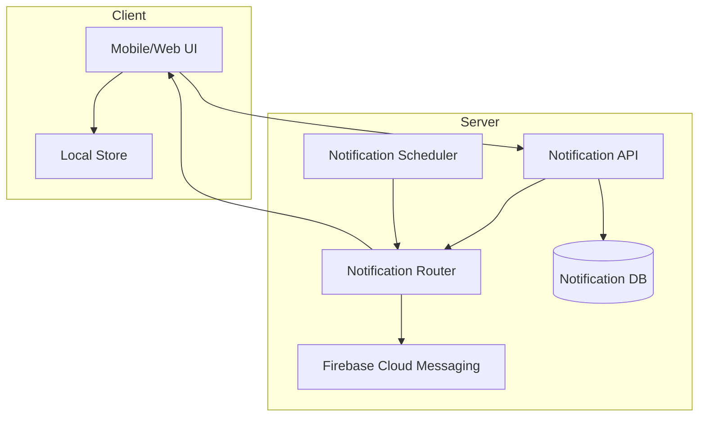

# Planning Examples

Complete examples of the `/vista:plan` 3-step workflow.

---

## Example 1: Notification System

### Invocation
```
/vista:plan notification-system
```

### Step 1: Scaffold and Explore

**Scaffold:**
```
$ python vista/scripts/setup-feature.py --name notification-system

Created .vista/features/notification-system/
  ├── arch/_arch.json
  ├── specs/
  ├── domain-requirements.md
  ├── progress.txt
  └── IMPLEMENTATION_PLAN.md
```

**Codebase Exploration (3 parallel Explore agents):**

Agent 1 — Similar Features:
```
Found existing notification-like patterns:
- Sync status indicator (lib/ui/home/widgets/sync_status_indicator.dart)
  Uses SnackBar for temporary messages, Provider pattern
- Hardware alerts (lib/data/providers/hardware_providers.dart)
  Riverpod with @riverpod, AlertDialog for critical alerts
- Toast messages (lib/ui/components/toast_messages.dart)
  Reusable display utility with success/error/info styles
```

Agent 2 — Project Structure:
```
Providers: lib/data/providers/ (23 files, shared)
Features: lib/ui/{feature}/ with screens/, widgets/, providers/
State: lib/data/state/ (12 Freezed classes)
```

Agent 3 — Patterns:
```
State management: Riverpod (23 providers), migrating from ChangeNotifier (5 legacy)
Code gen: @riverpod, @freezed
Database: Dual SQLite + Firestore
```

**Presented to user:**
> I explored the codebase and found 3 existing notification-like patterns (sync status, hardware alerts, toasts). The project uses Riverpod for state management with 23 providers and Freezed for state classes. Features live in `lib/ui/{feature}/`.

### Step 2: Deep Interactive Questioning

**2a. Problem & Users:**
```
Q: What business problem are we solving?
A: Coaches miss when athletes complete workouts. Athletes forget scheduled sessions.

Q: Who are the users?
A: Coaches (receive athlete activity notifications), Athletes (receive reminders)
```

**2b. Functional Requirements:**
```
Q: What are the core notification types?
A: Push for run completions, scheduled reminders, in-app sync status

Q: What platforms?
A: Mobile (iOS, Android) for push, Web for in-app only
```

*[Answers written incrementally to domain-requirements.md]*

**2h. TDD Candidates:**
```
Added to domain-requirements.md:

## TDD Candidates

- **NotificationScheduler**: Complex scheduling logic with timezone handling, recurrence rules, and quiet hours
- **NotificationRouter**: Routes notifications to correct channel (push/in-app/email) based on user preferences and platform
```

> Consider running `/vista:tdd notification-system` to generate test-first diagrams for NotificationScheduler and NotificationRouter before proceeding to specs.

### Step 3: Generate Architecture Diagrams

**Files generated in `arch/`:**

`system-architecture.mmd`:


`user-flow.mmd`, `data-model.mmd`, `sequence-send-notification.mmd`, `sequence-schedule-reminder.mmd`

**`_arch.json` manifest updated with all 5 diagrams.**

**Reported to user:**
> Generated 5 architecture diagrams. Review them at `<dashboard_url>/project/<id>/arch/notification-system` or read the `.mmd` files directly.
>
> Next steps:
> - `/vista:tdd notification-system` — Generate TDD diagrams for NotificationScheduler and NotificationRouter
> - `/vista:specs notification-system` — Generate topic specifications

---

## Example 2: Payment Processing

### Invocation
```
/vista:plan payment-flow
```

### Step 1: Scaffold and Explore

Brief exploration reveals no existing payment code. Found Stripe SDK in `pubspec.yaml` dependencies (unused). Project uses repository pattern for data access.

### Step 2: Deep Interactive Questioning

Key decisions captured:
- Stripe integration for card payments
- Support for subscriptions and one-time purchases
- Webhook handling for async events
- Refund processing via admin panel

TDD Candidates flagged:
- **PricingEngine**: Discount stacking, tax calculation, proration
- **SubscriptionStateMachine**: 8 states, 15 transitions, grace periods

### Step 3: Generate Architecture Diagrams

Generated 7 diagrams:
- `system-architecture.mmd` — Components: PricingEngine, PaymentGateway, WebhookHandler, SubscriptionManager
- `user-flow.mmd` — Checkout journey
- `data-model.mmd` — Order, LineItem, Payment, Subscription entities
- `sequence-checkout.mmd` — Client → API → Stripe → Webhook flow
- `sequence-subscription.mmd` — Subscribe, renew, cancel flows
- `state-subscription.mmd` — 8-state subscription lifecycle
- `state-payment.mmd` — Payment status transitions

---

## Example 3: Simple Feature (Minimal Diagrams)

### Invocation
```
/vista:plan user-preferences
```

### Step 1: Scaffold and Explore

Found existing settings screen at `lib/ui/settings/`. Uses SharedPreferences for local storage. Simple key-value pattern.

### Step 2: Deep Interactive Questioning

Requirements are straightforward:
- Theme preference (light/dark/system)
- Notification preferences (on/off per type)
- Units preference (metric/imperial)
- No complex logic, no external integrations

No TDD candidates flagged — all simple CRUD operations.

### Step 3: Generate Architecture Diagrams

Only 3 diagrams needed (simple feature):
- `system-architecture.mmd` — PreferencesService + SharedPreferences
- `user-flow.mmd` — Settings screen navigation
- `data-model.mmd` — UserPreferences entity

> Not every feature needs sequence or state diagrams. Use judgment based on complexity.

---

## Key Patterns

### Discovery Informs Questions
Codebase exploration in Step 1 gives you context to ask better questions in Step 2. Don't ask "what state management should we use?" when you can say "I see 23 Riverpod providers — should we follow that pattern?"

### Write Incrementally
Don't wait until all questions are answered. Write to `domain-requirements.md` after each topic area is discussed.

### TDD Flagging is Lightweight
Just identify components with heavy logic and note why. The actual TDD diagrams come from `/vista:tdd`.

### Diagram Count Varies
Simple features: 2-3 diagrams. Complex features: 5-8 diagrams. Don't generate diagrams that don't add value.
