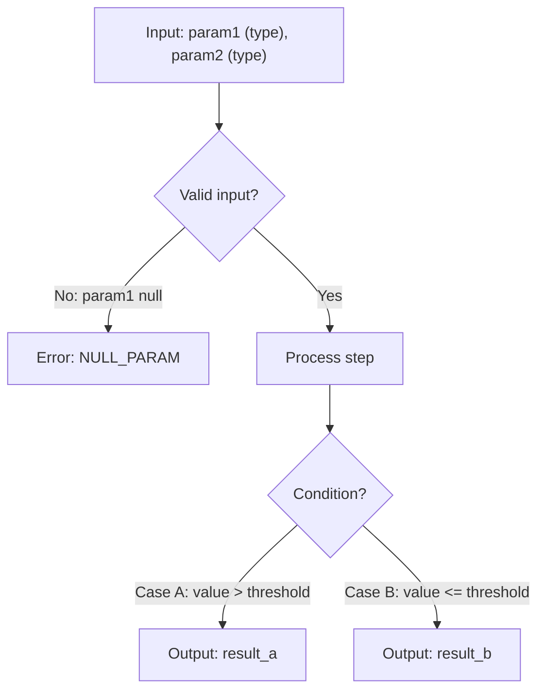
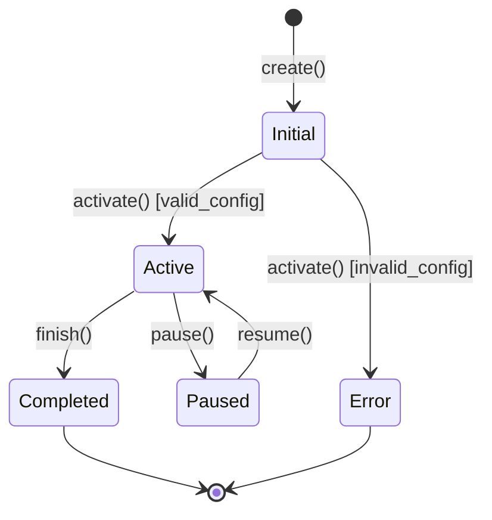
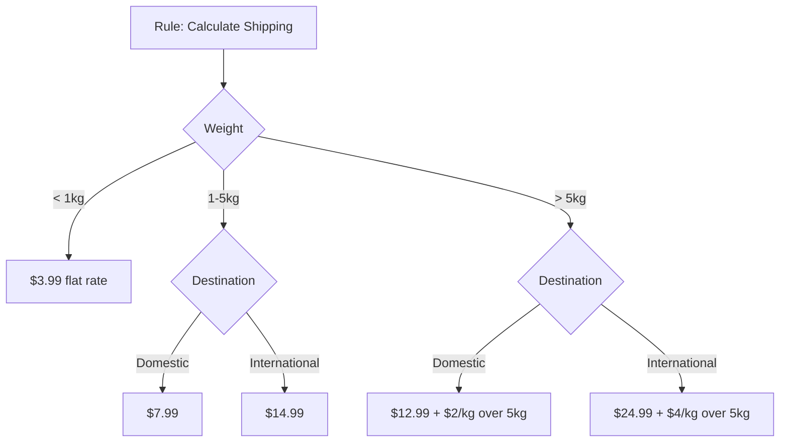

# TDD Diagram Guide

How to write effective TDD Mermaid diagrams that agents can translate directly into test cases.

---

## Core Principle

**Every node in a TDD diagram must map to a testable assertion.** If you can't write a test for it, it shouldn't be in the diagram.

---

## Diagram Types

### 1. Logic Flow Diagrams

**Purpose:** Map branching logic to test cases. Each path through the diagram = one test scenario.

**Conventions:**
- Input nodes at the top with explicit data types
- Output/result nodes at the bottom
- Decision diamonds for every branch point
- Edge labels describe the exact condition (not vague descriptions)
- Error nodes for failure paths

**Template:**


**Test extraction:**
- Path 1: null param1 → expect NULL_PARAM error
- Path 2: valid input + value > threshold → expect result_a
- Path 3: valid input + value <= threshold → expect result_b

### 2. State Diagrams

**Purpose:** Define valid state transitions. Anything NOT in the diagram is an invalid transition — test that it's rejected.

**Conventions:**
- Label every transition with the action/method name
- Include guard conditions in brackets where applicable
- Mark terminal states clearly
- List all valid states

**Template:**


**Test extraction:**
- Test each valid transition: create() → Initial, activate() with valid config → Active
- Test invalid transitions: Initial → Completed should be rejected
- Test guard conditions: activate() with invalid_config → Error
- Test terminal states: Completed and Error are final

### 3. Decision Trees

**Purpose:** Map business rule combinations to outcomes. Each leaf = one test case with specific input combination.

**Conventions:**
- Root node is the business rule being evaluated
- Each decision level is one input/condition
- Leaf nodes show the concrete outcome
- Label edges with exact values (not "some" or "varies")

**Template:**


**Test extraction:**
- (0.5kg, any) → $3.99
- (3kg, domestic) → $7.99
- (3kg, international) → $14.99
- (7kg, domestic) → $12.99 + $4.00 = $16.99
- (7kg, international) → $24.99 + $8.00 = $32.99
- Boundary: (1kg, domestic) → which rate? (test boundary)
- Boundary: (5kg, domestic) → which rate? (test boundary)

---

## Annotation Conventions

### Input Annotations
Always include data types and constraints on input nodes:
```
Input["Input: user_id (string, required), amount (decimal, >= 0)"]
```

### Output Annotations
Include the shape of the return value:
```
Output["Output: {success: bool, total: decimal, breakdown: LineItem[]}"]
```

### Error Annotations
Name specific error types, not generic "error":
```
ErrAuth["Error: UNAUTHORIZED (401)"]
ErrValidation["Error: INVALID_AMOUNT (amount < 0)"]
ErrTimeout["Error: UPSTREAM_TIMEOUT (> 5s)"]
```

### Edge Case Labels
Be specific about boundary values:
```
Decision -->|"amount == 0"| ZeroCase["Edge: zero amount"]
Decision -->|"amount == MAX_INT"| OverflowCase["Edge: overflow"]
```

---

## Quality Checklist

Before completing a TDD diagram:

- [ ] Every input has explicit types and constraints
- [ ] Every output has a concrete value or structure
- [ ] Every decision diamond has all branches covered (including edge cases)
- [ ] Every error path names a specific error type
- [ ] Boundary values are called out explicitly
- [ ] The diagram can be read top-to-bottom as a test specification
- [ ] An agent could write tests from this diagram without asking questions

---

## Anti-Patterns

**Too vague:**
```
Process --> Decision{Valid?}
Decision -->|Yes| Success["Success"]
Decision -->|No| Error["Error"]
```

**Better:**
```
Process --> Decision{Amount > 0 AND user.active?}
Decision -->|"Amount > 0 AND active"| Success["Return: {approved: true, ref_id: uuid}"]
Decision -->|"Amount <= 0"| ErrAmount["Error: INVALID_AMOUNT"]
Decision -->|"user.active == false"| ErrInactive["Error: USER_INACTIVE"]
```

**Too complex:** If a single diagram has more than ~15 decision points, split it into multiple diagrams (one per sub-concern).

---

## Integration with Specs

When `/vista:specs` runs after TDD diagrams are created, each spec for a TDD-flagged component will include a `## Testing Strategy` section that references these diagrams and translates them into test case descriptions.

When Ralph's build loop runs, the `PROMPT_build.md` instructs the agent to:
1. Read the TDD diagram
2. Write tests covering every path
3. Run tests (expect failures)
4. Implement to make tests pass
5. Verify all diagram paths are covered
